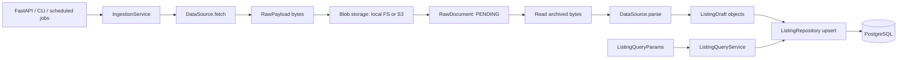

# Current architecture

[Guide index](README.md) · [Module map](modules.md)

## Boundaries

The backend uses ports (abstract interfaces) to separate business behavior from
storage, HTTP, and scheduling. [Container](../core/src/realestate/bootstrap.py)
constructs dependencies lazily with `cached_property` and owns their lifecycle.

| Layer | Responsibility | Dependency rule |
|---|---|---|
| `domain/` | Dataclasses, enums, errors, query objects, ports | Standard library and other domain modules only |
| `application/` | Ingestion/query services, job closures, DTOs | Domain and application modules; Pydantic for DTOs |
| `infrastructure/` | Tortoise repositories, source adapters, blobs, logs, scheduler | Implements domain ports; framework and I/O details stay here |
| `api/` | Validation, dependencies, HTTP errors and responses | Delegates work to services/repository ports |
| `config/` | Settings, path anchors, shared ORM configuration | Runtime configuration |
| Entrypoints | API factory, CLI, standalone worker | Obtain the object graph from `bootstrap.Container` |

Current boundary exceptions: `api/deps.py` exposes the concrete source registry,
and the readiness route queries Tortoise directly. Business services still depend
on ports. Avoid extending those exceptions into the domain or application.

## Runtime and data flow

1. `start_run()` validates the source and creates a `RUNNING` record.
2. `fetch()` yields bytes without parsing. Each payload is written to a blob, then
   recorded as a `PENDING` raw document. The fetch stage completes before parsing.
3. Parsing reconstructs `RawPayload` from archived bytes and metadata, produces
   drafts, and upserts listings. Parsers must be deterministic and use no network.
4. Successful documents become `PARSED`; document failures become `FAILED` with
   an error summary and incremented failure attempts. Tracebacks go to logs.
5. The run ends as `SUCCESS`, `PARTIAL` for handled archive/parse errors, or
   `FAILED` for an escaping exception. Item-level skips inside parsers are logged
   but do not increment the run's error counter.

`parse_pending()` handles only `PENDING`. `reparse()` handles `PARSED` and, by
default, `FAILED`. `reparse_stale()` handles archive documents parsed by an older
extraction graph; `rebuild()` deletes an archive source's listings and re-parses
all its payloads. None fetches new bytes; each records a scrape run with trigger
`REPLAY`. Documents parse in capture order (fetch order for live sources).
Archive sources also store a parse report (template, page kind, items kept and
dropped, identity problems) and the graph version on each document, and quality
counters on each run (`scrape_run.stats`).

## Storage and identity

| Record | Stores | Relationship |
|---|---|---|
| `scrape_run` | Source, trigger, status, times, counters, error | One run can archive many documents |
| `raw_document` | Blob locator/hash, source metadata, parse status | Optional run FK; bytes live outside PostgreSQL |
| `listing` | Normalized advert, price, location, attributes, content hash | Unique `(source_key, external_id)`; optional provenance FK |

FK deletion uses `SET NULL`. Locations are flattened onto listing rows. Money and
area use `Decimal`; coordinates are stored to six decimal places. Source-specific
extras go in `attributes`.

Upserts collapse duplicate IDs within a batch (last draft wins), then compare
`compute_content_hash()` against the stored business fields:

- New advert: create the row and provenance link.
- Changed advert: update fields, `last_seen_at`, `updated_at`, and provenance.
- Unchanged advert: update only `last_seen_at`; preserve `updated_at` and the
  previous provenance link. The queryset `.update()` deliberately avoids `auto_now`.

Blobs use `{source}/{YYYY}/{MM}/{DD}/{uuid}.{extension}` behind the `BlobProvider`
port, with two backends: local filesystem and S3-compatible object storage.
`validate_blob_key` (domain) rejects non-canonical keys, traversal and absolute
paths for every backend before any I/O. Filesystem writes use a temporary sibling
plus atomic replacement; S3 relies on `PutObject` being atomic. The database
stores the backend-neutral key and the backend-specific `blob_uri`, so changing
backends needs the existing objects copied across under the same keys. Payload SHA-256
lookup exists, but ingestion currently archives repeated payloads again.

## Query path

`ListingQueryParams` validates HTTP input and builds a framework-free
`ListingQuery`. The query service enforces the maximum page size of 100;
repositories apply filters and return domain objects, then DTOs serialize them.

Radius search uses an outward-rounded bounding box followed by exact haversine
SQL. Polar and antimeridian cases relax longitude filtering. Counts use the same
distance filter as results; every sort adds `id` for stable paging. There is no
PostGIS dependency. Recheck SQL annotation behavior when upgrading Tortoise.

## Current limits

- API background tasks and APScheduler jobs run in memory. There is no durable
  queue, distributed lock, or cross-process run exclusion.
- Blob writes, raw-document creation, listing writes, and status updates are
  separate operations. Failures can leave orphan blobs, pending documents, or
  partial listing writes; the pipeline is not one atomic transaction.
- A fetch exception can leave earlier archived documents pending. Process loss
  can leave a run `RUNNING`; catch-up parsing does not finish that run record.
- Replay can overwrite current listing values with historical values. It is
  bounded, ordered oldest first, and has no CLI pagination cursor.
- No cross-source deduplication, currency conversion, or automatic stale-listing
  job. `mark_stale()` exists as a repository operation only.
- Read endpoints are public; only the ingestion trigger requires the admin key.
- Zillow and browser-driver hooks remain placeholders. See [sources](sources.md).
