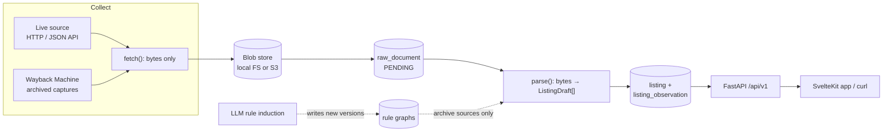
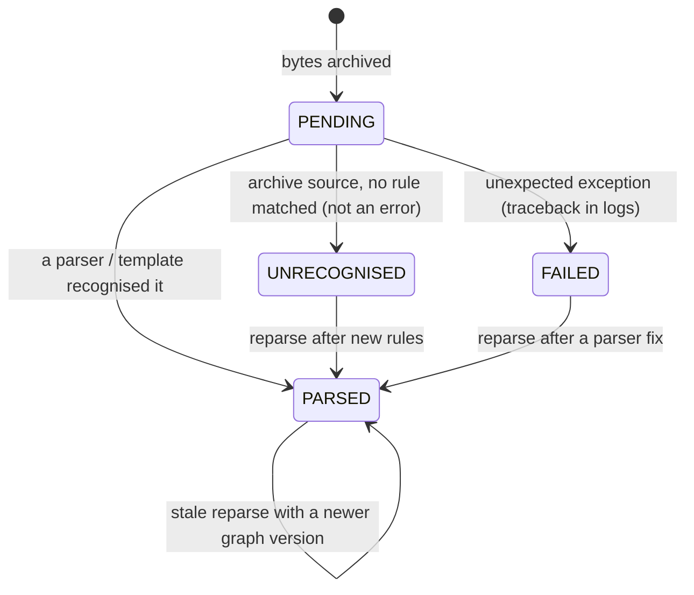
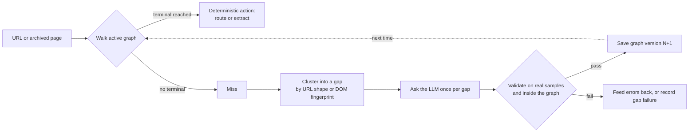

# Backend onboarding: how realestatepy works

[Guide index](README.md) · [Architecture](architecture.md) · [Module map](modules.md) · [Data sources](sources.md)

This guide is for engineers new to the backend in `core/`. It builds the mental
model in order: what the system does, how the code is layered, how data moves from
a website into the API, how data sources plug in, how the LLM-built state machine
learns to read archived websites, and where caching happens.

The other guides in this folder are references, and they are more exhaustive.
This one explains the reasoning behind the design and links to them for detail.
Code excerpts are trimmed for length (`...` marks cuts). The linked file is
always the source of truth.

**Contents**

1. [What the backend does](#1-what-the-backend-does)
2. [Run it in five minutes](#2-run-it-in-five-minutes)
3. [Architecture: ports, adapters and one composition root](#3-architecture-ports-adapters-and-one-composition-root)
4. [The ingestion pipeline: fetch, archive, parse](#4-the-ingestion-pipeline-fetch-archive-parse)
5. [Data sources](#5-data-sources)
6. [The LLM-powered state machine](#6-the-llm-powered-state-machine)
7. [Caching](#7-caching)
8. [First-week gotchas](#8-first-week-gotchas)
9. [Glossary](#9-glossary)
10. [Where to go next](#10-where-to-go-next)

---

## 1. What the backend does

Realestatepy is a property-classifieds aggregator. Background jobs collect adverts
from several portals, normalise them into one PostgreSQL dataset, and serve that
dataset over a filterable REST API (FastAPI). A SvelteKit app (`main_frontend/`)
uses the API for sign-in and price-trend charts.

There are two very different kinds of input:

| Kind | Example | How it is read |
|---|---|---|
| **Live sources** | `dubizzle_eg` (a JSON search API), `fixture` (local JSON files) | A hand-written Python parser per source |
| **Archive sources** | `olx_eg_wayback`, `dubizzle_eg_wayback`, `opensooq_eg_wayback` (the Wayback Machine, 2008–2026) | **Rule graphs**: data-driven state machines, partly written by an LLM, executed by a deterministic engine |

Archive sources are what make the project unusual. OLX Egypt alone went through at
least five site redesigns between 2010 and 2023, and the archive holds hundreds of
thousands of captures. Hand-writing a parser for every design is slow. Calling an
LLM on every page would be expensive, slow and non-deterministic. The backend does
neither: **the LLM writes rules once per *kind* of page, and plain code applies
those rules to every page.** Section 6 explains how.



---

## 2. Run it in five minutes

From `core/` (full setup in [development.md](development.md)):

```bash
./scripts/db_up.sh                                      # PostgreSQL (sudo on some machines)
./scripts/migrate.sh                                    # aerich upgrade
./venv/bin/python -m realestate.cli scrape --source fixture --max-items 2
./scripts/dev.sh                                        # http://127.0.0.1:8000/docs
```

Then query what you ingested:

```bash
curl 'http://127.0.0.1:8000/api/v1/listings?listing_type=RENT&sort=price_asc&limit=3'
curl 'http://127.0.0.1:8000/api/v1/runs?limit=1'        # how the last run went
```

The `fixture` source reads `var/fixtures/*.json` and needs no network. Use it to
watch the whole pipeline run before you touch a real portal.

The checks every change must pass:

```bash
./venv/bin/pytest
./venv/bin/ruff check src tests
./venv/bin/mypy
```

---

## 3. Architecture: ports, adapters and one composition root

### The layers

```
domain/          entities, enums, ports (ABCs). Imports NO framework.
   ▲
application/     services, jobs, pydantic DTOs. Imports domain only.
   ▲
infrastructure/  Tortoise ORM, httpx, APScheduler, filesystem, S3, Ollama.
api/             FastAPI routers and dependency injection.
   ▲
bootstrap.py     the ONLY module allowed to import every layer.
```

Every arrow points inward. Business logic (`application/`) depends only on
**ports**: abstract base classes in `domain/ports/` that describe *what* is needed
("store these bytes", "ask a model for a JSON object") and say nothing about *how*.
`infrastructure/` provides the *how*.

Here is a complete port. The domain knows only "send messages, get a dict back":

```python
# core/src/realestate/domain/ports/llm.py
class StructuredLlm(ABC):
    """A chat model asked for one JSON object per call."""

    @property
    @abstractmethod
    def model(self) -> str:
        """Model identifier, recorded with every decision."""

    @abstractmethod
    async def complete(
        self,
        messages: Sequence[LlmMessage],
        *,
        schema: Mapping[str, Any],
        tool_name: str,
        tool_description: str,
    ) -> LlmResponse: ...
```

`OllamaLlm` in [infrastructure/llm/ollama.py](../core/src/realestate/infrastructure/llm/ollama.py)
implements it. Ollama Cloud has no structured-output mode, so the adapter offers
the schema as a tool and falls back to the first JSON object in the reply. The
rule-induction service never sees that detail. Tests swap in `ScriptedLlm` from
[tests/archive_fakes.py](../core/tests/archive_fakes.py), which answers from a queue:

```python
llm = ScriptedLlm(by_tool={"submit_rules": [{"rules": [...]}]})
```

The layering is enforced by grep, and both commands must print nothing:

```bash
grep -rE "^\s*(from|import) realestate\.infrastructure" src/realestate/application src/realestate/domain
grep -rE "^\s*(from|import) (tortoise|fastapi|pydantic)" src/realestate/domain
```

### The composition root

[bootstrap.py](../core/src/realestate/bootstrap.py) holds `Container`, the one
place that picks concrete classes. Every component is a lazy `cached_property`, so
the CLI never builds a scheduler and the API never builds a Wayback client unless
it uses one:

```python
# core/src/realestate/bootstrap.py
class Container:
    @cached_property
    def blob(self) -> BlobProvider:              # typed as the port...
        return BlobProviderFactory.create(self.settings.blob)   # ...built as local FS or S3

    @cached_property
    def ingestion(self) -> IngestionService:
        return IngestionService(
            registry=self.registry,
            blob=self.blob,
            listings=self.listings,
            documents=self.documents,
            runs=self.runs,
            log=self.log,
            links=FrontierLinkSink(self.frontier, self.link_requests),
        )
```

Everything else receives its collaborators through constructor arguments. That is
the whole dependency-injection system: no framework, no globals. The entrypoints
(`main.py` for the API, `cli.py`, `worker.py` for the scheduler, `ingest.py` for
cron batches) each build a `Container` and ask it for services.

### Following one request

`GET /api/v1/listings?city=Cairo&price_max=20000` goes through every layer:

1. [api/v1/listings.py](../core/src/realestate/api/v1/listings.py) receives it.
   FastAPI validates the query string into `ListingQueryParams`, a pydantic DTO.
2. `ListingQueryParams.to_domain()` ([application/dto/query.py](../core/src/realestate/application/dto/query.py))
   converts it into a framework-free `domain.query.ListingQuery`.
3. `ListingQueryService` enforces the page-size cap and calls the
   `ListingRepository` **port**.
4. `TortoiseListingRepository` builds the SQL query (including the
   bounding-box-plus-haversine radius filter) and returns **domain dataclasses**,
   never ORM models.
5. The router converts them to `ListingRead` DTOs for the response.

To add a filter, start at `ListingQueryParams` and work down. [development.md](development.md#common-changes)
lists which files change together for each common change.

---

## 4. The ingestion pipeline: fetch, archive, parse

### The invariant everything rests on

> `fetch()` produces bytes only. They are archived to the blob store and recorded
> as a `PENDING` raw document. `parse()` then reads those archived bytes back.
>
> - `fetch()` must never parse.
> - `parse()` must never touch the network, and must be deterministic.

This split lets you fix a broken parser and **replay** months of stored payloads
without contacting a website again. It is also why parser bugs never lose data:
the original bytes are always kept.

[IngestionService](../core/src/realestate/application/services/ingestion_service.py)
implements both stages. The fetch stage archives each payload and records it before
anything is interpreted:

```python
# core/src/realestate/application/services/ingestion_service.py (trimmed)
async for payload in source.fetch(ctx):
    try:
        documents.append(await self._archive(source_key, payload, run_id))
    except Exception as exc:
        await source.acknowledge(payload, error=f"archive failed: {exc}")
        continue
    await source.acknowledge(payload)          # only now is the work item "done"

async def _archive(self, source_key, payload, run_id) -> RawDocument:
    key = build_blob_key(source_key, payload.kind)       # fixture/2026/10/05/<uuid>.json
    blob = await self._blob.put(key, payload.content, content_type=payload.content_type)
    return await self._documents.create(source_key=source_key, payload=payload, blob=blob, ...)
```

The parse stage reads the bytes **back from the blob store**, never from memory,
so a first parse and a replay a year later take exactly the same path:

```python
# core/src/realestate/application/services/ingestion_service.py (trimmed)
for document in documents:
    try:
        content = await self._blob.get(document.blob_key)
        payload = RawPayload(content=content, kind=document.kind, meta=document.meta, ...)
        drafts = await source.parse(payload)
        result = await self._listings.upsert_many(drafts, source_key=..., raw_document_id=document.id)
    except UnrecognisedDocumentError as exc:
        await self._documents.mark_unrecognised(document.id, str(exc), ...)  # induction will learn it
        continue
    except Exception as exc:
        await self._documents.mark_failed(document.id, f"{type(exc).__name__}: {exc}")
        continue
    await self._documents.mark_parsed(document.id, ...)
```

### Document lifecycle



Replay commands (none of them fetch anything):

```bash
python -m realestate.cli parse                                    # drain PENDING
python -m realestate.cli parse --source dubizzle_eg --reparse     # PARSED + FAILED again
python -m realestate.cli parse --source olx_eg_wayback --stale    # docs parsed by an older graph
python -m realestate.cli parse --source olx_eg_wayback --unrecognised
```

### Change detection: why `updated_at` means something

Portals return the same adverts on every scrape. Upserts are keyed on
`(source_key, external_id)`, and each draft's *business fields* are hashed by
[domain/hashing.py](../core/src/realestate/domain/hashing.py):

```python
# core/src/realestate/domain/hashing.py (trimmed)
"attributes": {
    key: value for key, value in draft.attributes.items() if not key.startswith("_")
},
...
payload = json.dumps({key: fingerprint[key] for key in _HASHED_FIELDS},
                     sort_keys=True, default=str, ensure_ascii=False)
return hashlib.sha256(payload.encode("utf-8")).hexdigest()
```

| Stored hash vs. new hash | What happens |
|---|---|
| No row yet | Insert |
| Different | Update the row; `updated_at` moves |
| Same | A queryset `.update()` moves only `last_seen_at`. It deliberately does not fire `auto_now`, so `updated_at` stays put |

`_`-prefixed attributes (rule versions, provenance) are excluded, so a new
extraction rule that reads the same values does not look like an edit. Archive
sources also write one `listing_observation` row per capture, with that capture's
price and a full snapshot. Market trends are computed from these rows.

---

## 5. Data sources

### The contract

Every portal implements one port,
[domain/ports/data_source.py](../core/src/realestate/domain/ports/data_source.py):

```python
class DataSource(ABC):
    key: ClassVar[str]            # stable id; also the blob key prefix and API path segment
    display_name: ClassVar[str]
    country_code: ClassVar[str]

    @abstractmethod
    def fetch(self, ctx: FetchContext) -> AsyncIterator[RawPayload]:
        """Yield raw payloads. Must not parse or persist anything."""

    @abstractmethod
    async def parse(self, payload: RawPayload) -> Sequence[ListingDraft]:
        """Archived bytes -> drafts. Pure with respect to the network."""

    # Optional hooks with safe defaults:
    async def discover_links(self, payload) -> Sequence[DiscoveredLink]: return ()
    async def acknowledge(self, payload, *, error=None) -> None: ...
    async def aclose(self) -> None: ...
```

A `RawPayload` is just `content: bytes` plus `kind`, `content_type`, `source_url`
and a free-form `meta` dict. Put into `meta` anything the parser will need during a
replay (page number, capture timestamp, URL). Nothing else survives between the
two stages.

### "Exists" is code, "switched on" is config

Registration in [infrastructure/sources/defaults.py](../core/src/realestate/infrastructure/sources/defaults.py)
decides which sources exist:

```python
registry.register(
    key=DubizzleEgDataSource.key,
    display_name=DubizzleEgDataSource.display_name,
    country_code=DubizzleEgDataSource.country_code,
    factory=lambda ctx: DubizzleEgDataSource(log=ctx.log, params=ctx.params),
    implemented=True,
)
```

`etc/settings.toml` decides whether a source is scheduled and with which
parameters. `params` reaches the factory as `ctx.params`:

```toml
[sources.dubizzle_eg]
enabled = true                 # governs *scheduling* only; manual runs always work
interval_minutes = 180         # or crontab = "0 */3 * * *"
params = { categories = ["apartments-duplex-for-sale"], page_size = 20 }
```

`Container.register_scheduled_jobs()` turns each enabled source with a schedule
into an APScheduler job. `implemented=False` keeps a stub such as `zillow` visible
in `/sources`, and running it returns HTTP 501.

### A live source, by example

[FixtureDataSource](../core/src/realestate/infrastructure/sources/fixture/source.py)
is the reference implementation. Three habits from it apply to every source:

```python
# 1. Explicit vocabulary maps: portal words -> domain enums.
_PURPOSE_MAP = {"rent": ListingType.RENT, "for-sale": ListingType.SALE, ...}

async def parse(self, payload: RawPayload) -> Sequence[ListingDraft]:
    document = json.loads(payload.content.decode("utf-8"))
    results = document.get("results")
    if not isinstance(results, list):
        # 2. A page that is structurally wrong raises ParseError -> FAILED, replayable.
        raise ParseError(f"{self.key}: expected a 'results' array")
    drafts = []
    for index, item in enumerate(results):
        try:
            drafts.append(self._to_draft(item))
        except (KeyError, TypeError, ValueError, InvalidOperation) as exc:
            # 3. One malformed advert must not lose the rest of the page.
            await self._log.warning("skipping unparseable item", index=index, error=str(exc))
    return drafts
```

A new HTTP portal subclasses `HttpDataSource`
([sources/base.py](../core/src/realestate/infrastructure/sources/base.py)). It
provides a shared `httpx` client, a concurrency cap, a minimum delay between
requests, retries with exponential backoff, and user-agent rotation. You call
`self.request()` and write only the portal-specific parts. A hypothetical source:

```python
class AcmeEgDataSource(HttpDataSource):
    key = "acme_eg"
    display_name = "Acme Egypt"
    country_code = "EG"
    min_delay_seconds = 1.0                      # be polite

    async def fetch(self, ctx: FetchContext) -> AsyncIterator[RawPayload]:
        for page in range(1, (ctx.page_limit or 5) + 1):
            response = await self.request("GET", "https://acme.example/api/search",
                                          params={"page": page})
            yield RawPayload(
                content=response.content,         # bytes, untouched
                kind=RawDocumentKind.JSON,
                content_type="application/json",
                source_url=str(response.url),
                meta={"page": page},
            )

    async def parse(self, payload: RawPayload) -> Sequence[ListingDraft]:
        ...                                       # bytes -> ListingDraft[], no network
```

Then register it, add `[sources.acme_eg]` to the settings, add sanitised fixtures
and offline tests, and try it with `cli scrape --source acme_eg`. The full checklist
is in [sources.md](sources.md#add-or-repair-an-adapter).

### An archive source, by example

Archive sources subclass `WaybackDataSource`
([sources/wayback/source.py](../core/src/realestate/infrastructure/sources/wayback/source.py)).
The generic class does the hard parts: it claims queued captures from the crawl
frontier, replays them from the Wayback Machine with redirect and timestamp checks,
and parses them by walking the extraction rule graph. A new archive source can be
this small:

```python
# core/src/realestate/infrastructure/sources/dubizzle_eg_wayback/source.py
class DubizzleEgWaybackDataSource(WaybackDataSource):
    key: ClassVar[str] = "dubizzle_eg_wayback"
    display_name: ClassVar[str] = "Dubizzle Egypt (archived)"
    country_code: ClassVar[str] = "EG"

    default_domain: ClassVar[str] = "dubizzle.com.eg"
    default_from_year: ClassVar[int] = 2023
    default_to_year: ClassVar[int] = 2026
```

The class contains no selectors and no parsing code, because the rules live in the
database (section 6). A subclass may add two pieces of **fixed, reviewed** code,
because mistakes in either would pass every automatic plausibility check:

```python
# core/src/realestate/infrastructure/sources/olx_eg_wayback/source.py (trimmed)
OLX_EG_IDENTITY = IdentityPolicy(
    id_patterns=(r"-iid-(\d+)", r"/iid-(\d+)", r"-ID(\d+)\.html", ...),   # group 1 = external id
    reject_patterns=(r"/search/?(?:\?|$)", r"/(?:login|register|myolx)", ...),  # never one advert
    advert_patterns=(r"-ID([0-9A-Za-z]+)\.html",),   # names an advert, but not a trusted id
)

class OlxEgWaybackDataSource(WaybackDataSource):
    ...
    def identity_policy(self) -> IdentityPolicy:     # which part of a URL is the advert id
        return OLX_EG_IDENTITY

    def extraction_seed(self) -> ExtractionSeed:     # curated templates from templates.json
        return _load_seed()
```

```python
>>> OLX_EG_IDENTITY.canonical_id("http://cairo.olx.com.eg/flat-for-rent-in-maadi-iid-535715253")
'535715253'
>>> OLX_EG_IDENTITY.canonical_id("https://www.olx.com.eg/search/") is None
True
```

If induced rules chose advert identities, one bad regex could merge thousands of
unrelated adverts into one row, and every field would still look populated. That
is why identity is fixed code and never induced.

---

## 6. The LLM-powered state machine

### 6.1 The idea in one paragraph

A **rule graph** is a versioned state machine stored in PostgreSQL. Each input (a
URL to route, or an archived page to extract) walks the graph from `root`.
Guarded edges lead to terminal states that carry an action. When a walk reaches no
terminal state, that input is a **miss**. Misses are clustered into **gaps**, and
each gap becomes one question to an LLM. The model answers with *selectors,
regexes and vocabulary, never with listing values*. The answer is validated
against real archived pages. If it passes, it is compiled into new states in a new,
immutable graph version, and the same kind of input becomes a **hit** that never
needs the model again. In other words, [the graph is a cache of LLM decisions](#71-the-rule-graph-is-a-cache-of-llm-decisions).



Two graphs per archive source answer two different questions:

| Graph (`RuleDomain`) | Input | Question | Terminal node | Selection rule |
|---|---|---|---|---|
| `NAVIGATION` | URL + link evidence | Fetch, skip, or wait? | `ROUTE` | First valid route wins |
| `EXTRACTION` | Archived bytes + URL + capture time | Which recipe reads this page? | `TEMPLATE` | Every matching template runs; curated beats induced, then the richest result wins |

### 6.2 Anatomy of a graph

The structure lives in [domain/rules.py](../core/src/realestate/domain/rules.py)
and is plain frozen dataclasses:

```python
@dataclass(frozen=True, slots=True)
class RuleNode:
    key: str                       # "root", "nav.v7.2", "tpl.v12.embedded_state_list", "olx.a1_2011_list"
    kind: NodeKind                 # ROOT | BRANCH | ROUTE | TEMPLATE
    action: dict[str, Any] = ...   # route decision or extraction recipe (JSONB)
    origin: RuleOrigin = SEED      # SEED | HUMAN | LLM
    llm_decision_id: UUID | None = None   # which model answer created it

@dataclass(frozen=True, slots=True)
class RuleEdge:
    from_key: str
    to_key: str
    condition: dict[str, Any]      # JSON condition (below)
    priority: int = 100            # lower is tried first

@dataclass(frozen=True, slots=True)
class RuleGraph:
    source_key: str
    domain: RuleDomain
    version: int                   # immutable: a version never changes once saved
    nodes: tuple[RuleNode, ...]
    edges: tuple[RuleEdge, ...]
    vocab: dict[str, list[dict[str, Any]]]   # {"listing_type": [{"pattern", "value"}], ...}
```

Conditions are JSON objects interpreted by
[extraction/conditions.py](../core/src/realestate/infrastructure/extraction/conditions.py):

| `type` | Example | Holds when |
|---|---|---|
| `url_regex` | `{"type": "url_regex", "pattern": "/properties/"}` | The URL matches (case-insensitive) |
| `evidence` | `{"type": "evidence", "key": "linked_as", "in": ["DETAIL"]}` | A recognised page linked here with that role |
| `dom_css` | `{"type": "dom_css", "css": "ul#the-list > li", "min": 3}` | Enough elements match the selector |
| `text_regex` | `{"type": "text_regex", "pattern": "للبيع", "css": "h1"}` | Text in the page or selection matches |
| `json_path` | `{"type": "json_path", "script": "state", "path": "algolia.content.hits"}` | Embedded JSON contains the path |
| `capture_range` | `{"type": "capture_range", "from": "2013", "to": "2014-06"}` | The capture date is inside the range |
| `template_fp` | `{"type": "template_fp", "fingerprint": "199f…", "max_distance": 8}` | The DOM structure is close to a known design |
| `spacy_match` | `{"type": "spacy_match", "patterns": [...]}` | spaCy token patterns match |
| `all` / `any` / `not` | `{"type": "all", "conditions": [...]}` | Boolean combinations |

A malformed condition evaluates to **false** at parse time, because one bad
machine-written rule must not stop a parse. Validation runs the same condition in
strict mode (`check()`), which raises on errors, so bad rules are rejected before
they are saved.

### 6.3 Walking the graph

The whole walk is a short depth-first generator. It yields every reachable
terminal in edge-priority order, and the caller decides what to do with them:

```python
# core/src/realestate/domain/rules.py
def _walk(self, key, evaluate, path, visiting):
    if key in visiting:            # a malformed cyclic graph must not hang a parse
        return
    visiting = visiting | {key}
    index = self._indexed()
    for edge in index.outgoing.get(key, ()):
        child = index.nodes.get(edge.to_key)
        if child is None or not evaluate(edge.condition):
            continue
        if child.kind in (NodeKind.ROUTE, NodeKind.TEMPLATE):
            yield child, [*path, child.key]
        else:
            yield from self._walk(child.key, evaluate, [*path, child.key], visiting)
```

[HtmlRuleEngine](../core/src/realestate/infrastructure/extraction/engine.py) is
the consumer. `route()` returns the **first** valid `ROUTE`. `extract()` runs
**every** matching `TEMPLATE` and keeps the best result:

```python
# core/src/realestate/infrastructure/extraction/engine.py (trimmed)
for node, path in graph.candidates(lambda condition: evaluate(condition, ctx)):
    outcome = self._run(graph, node, parsed, ...)
    # A template that matched but produced nothing usable is skipped,
    # so a too-generic earlier rule cannot shadow a better one.
    if outcome is not None and outcome.succeeded:
        succeeded.append((node, outcome))
...
# curated (HUMAN/SEED) first, then most adverts, then most detail values filled
return max(succeeded, key=lambda pair: (_curated(pair[0]), *_richness(pair[1])))[1]
```

### 6.4 Worked example: build a graph by hand and run it

The fastest way to understand the engine is to drive it from a REPL
(`./venv/bin/python` in `core/`). This example uses real classes and needs no
database. Its output was captured from the current code.

**Navigation.** Start from the generic seed (version 1: follow links from
recognised pages), then append the kind of rule the LLM would add:

```python
from realestate.application.rules.seeds import seed_navigation_graph
from realestate.domain.enums import NodeKind, RuleOrigin
from realestate.domain.rules import ROOT_KEY, RuleEdge, RuleNode
from realestate.infrastructure.extraction.engine import HtmlRuleEngine

engine = HtmlRuleEngine()
nav = seed_navigation_graph("demo")                    # v1
nav = nav.extended(                                    # v2: an "induced" SKIP rule
    nodes=[RuleNode("nav.v2.1", NodeKind.ROUTE,
                    {"decision": "SKIP", "page_kind": "OTHER", "priority": 0},
                    origin=RuleOrigin.LLM)],
    edges=[RuleEdge(ROOT_KEY, "nav.v2.1",
                    {"type": "url_regex", "pattern": r"/(cars|vehicles|mobile-phones)/"},
                    priority=nav.next_edge_priority())],
)

engine.route(nav, "https://www.olx.com.eg/en/vehicles/cars-for-sale/", {})
# RouteOutcome(decision=SKIP, node_key='nav.v2.1', priority=0, page_kind=OTHER)

engine.route(nav, "https://www.olx.com.eg/ad/-ID9v1Io.html", {})
# None  -> a miss: this capture becomes UNROUTED, eligible for induction

engine.route(nav, "https://www.olx.com.eg/ad/-ID9v1Io.html", {"linked_as": ["DETAIL"]})
# RouteOutcome(decision=FETCH, node_key='seed.follow_links_from_recognised_pages',
#              priority=75, page_kind=DETAIL)
```

The last two calls show **link evidence**. The URL `/ad/-ID9v1Io.html` says
nothing about property. Once a recognised property list links to it as a
`DETAIL`, the priority-0 seed edge fetches it. Extraction results feed back into
navigation this way.

> Two priorities with opposite meanings: an **edge** priority orders rule
> evaluation (lower first), and a **route action** priority orders fetching
> (higher first).

**Extraction.** An empty graph (version 0) misses every page. Add a template
(this one is a trimmed copy of the curated `a1_2011_list` in
[templates.json](../core/src/realestate/infrastructure/sources/olx_eg_wayback/templates.json))
and some vocabulary:

```python
from datetime import UTC, datetime
from realestate.domain.archive import ArchivedDocument
from realestate.domain.enums import RuleDomain
from realestate.domain.rules import RuleGraph
from realestate.infrastructure.sources.olx_eg_wayback.source import OLX_EG_IDENTITY

html = b"""<html><body><ul id="the-list">
<li><div class="c-2"><h3><a href="http://cairo.olx.com.eg/flat-for-rent-in-maadi-iid-111">Flat for rent in Maadi</a></h3>
<p><span><a>Apartments for rent - Cairo</a></span></p></div><div class="c-3">5,000 EGP</div></li>
<li><div class="c-2"><h3><a href="http://cairo.olx.com.eg/villa-for-sale-iid-222">Villa for sale</a></h3>
<p><span><a>Villas for sale - Giza</a></span></p></div><div class="c-3">3,500,000 EGP</div></li>
<li><div class="c-2"><h3><a href="http://cairo.olx.com.eg/shop-iid-333">Shop</a></h3>
<p><span><a>Shops for rent - Alexandria</a></span></p></div><div class="c-3">12,000 EGP</div></li>
</ul></body></html>"""
doc = ArchivedDocument(html, "http://cairo.olx.com.eg/properties/", datetime(2011, 6, 1, tzinfo=UTC))

ext = RuleGraph.empty("demo", RuleDomain.EXTRACTION)
engine.extract(ext, doc, country_code="EG", identity=OLX_EG_IDENTITY)
# None  -> parse() raises UnrecognisedDocumentError; the document becomes UNRECOGNISED

ext = ext.extended(
    nodes=[RuleNode("tpl.v1.old_list", NodeKind.TEMPLATE, {
        "page_kind": "LIST",
        "items": {"css": "ul#the-list > li"},
        "fields": {
            "title":    [{"css": ".c-2 h3 a"}],
            "url":      [{"css": ".c-2 h3 a", "attr": "href"}],
            "price":    [{"css": ".c-3"}],
            "category": [{"css": ".c-2 p span a"}],
            "location": [{"css": ".c-2 p span a", "regex": "-\\s*([^-]+)$"}],
        },
    }, origin=RuleOrigin.LLM)],
    edges=[RuleEdge(ROOT_KEY, "tpl.v1.old_list",
                    {"type": "dom_css", "css": "ul#the-list > li div.c-2 h3 a", "min": 3})],
    vocab={
        "listing_type":  [{"pattern": "for[- ]rent", "value": "RENT"},
                          {"pattern": r"\bsale\b", "value": "SALE"}],
        "property_type": [{"pattern": "villa", "value": "VILLA"},
                          {"pattern": "flat|apartment", "value": "APARTMENT"},
                          {"pattern": "shop", "value": "SHOP"}],
    },
)
out = engine.extract(ext, doc, country_code="EG", identity=OLX_EG_IDENTITY)
for d in out.drafts:
    print(d.external_id, d.title, d.listing_type, d.property_type,
          d.price.amount, d.price.currency, d.price.price_type, d.location.city)
```

```
111 Flat for rent in Maadi RENT APARTMENT 5000.00 EGP PER_MONTH Cairo
222 Villa for sale SALE VILLA 3500000.00 EGP TOTAL Giza
333 Shop RENT SHOP 12000.00 EGP PER_MONTH Alexandria
```

The template contains no `external_id` field, yet every draft has one, because the
identity policy read it from each advert's URL (`-iid-111`). The template only
says *where* things are. Deterministic code in
[template.py](../core/src/realestate/infrastructure/extraction/template.py) and
[normalisers.py](../core/src/realestate/infrastructure/extraction/normalisers.py)
turns `"3,500,000 EGP"` into `Decimal("3500000")` + `EGP`, maps
`"Shops for rent"` through the vocabulary, and defaults a rent without a stated
period to `PER_MONTH`.

### 6.5 How the graph grows: gaps

[RuleInductionService](../core/src/realestate/application/services/rule_induction_service.py)
turns misses into questions. It clusters them first, so one answer can cover many
inputs:

**Navigation gaps cluster by URL shape** (`domain/archive.url_shape`). Literal
segments are kept, while ids and slugs are folded:

```python
>>> url_shape("https://www.olx.com.eg/en/properties/apartments-for-sale/cairo/?page=3")
'olx.com.eg/en/properties/apartments-for-sale/*|d3|q:page'
>>> url_shape("http://cairo.olx.com.eg/apartment-for-rent-in-maadi-iid-535715253")
'*.olx.com.eg/*-iid-X|d1'
>>> url_shape("https://www.olx.com.eg/ad/-ID9v1Io.html") == url_shape("https://www.olx.com.eg/ad/shqa-ID9aBcD.html")
True
```

**Extraction gaps cluster by page design.** A structural fingerprint is a 64-bit
simhash over `parent>child` tag/class pairs, with text ignored
([fingerprint.py](../core/src/realestate/infrastructure/extraction/fingerprint.py)).
Two captures of one design years apart differ by a few bits, while a redesign
differs by many. Fingerprints within 10 bits count as one gap.

Extraction gaps also include documents that were `PARSED` *badly*: identity
problems, most items dropped, or an `OTHER` page that links to three or more
adverts. A wrong but populated result counts as a gap, not a success.

### 6.6 What the model is asked, and what it answers

Prompts and JSON schemas live in [application/rules/prompts.py](../core/src/realestate/application/rules/prompts.py).
A navigation question shows numbered URL-shape groups with their *current*
unrouted sample URLs. The model must call the `submit_rules` tool with something
like:

```json
{
  "rules": [
    {"group": 1, "pattern": "/properties/|/real-estate/", "decision": "FETCH",
     "page_kind": "LIST", "priority": 60, "reason": "property category listings"},
    {"group": 2, "pattern": "/(vehicles|cars|mobile-phones)/", "decision": "SKIP",
     "page_kind": "OTHER", "priority": 0, "reason": "non-property categories"}
  ]
}
```

Each accepted rule is compiled into one `ROUTE` node and one `url_regex` edge from
`root`, appended after the existing edges:

```python
# core/src/realestate/application/services/rule_induction_service.py (trimmed)
key = f"nav.v{graph.version + 1}.{offset + 1}"
nodes.append(RuleNode(key=key, kind=NodeKind.ROUTE,
                      action={"decision": rule.decision, "page_kind": rule.page_kind,
                              "priority": rule.priority, "gap": gap.fingerprint, ...},
                      origin=RuleOrigin.LLM, llm_decision_id=answer.decision_id))
edges.append(RuleEdge(from_key=ROOT_KEY, to_key=key,
                      condition={"type": "url_regex", "pattern": rule.pattern},
                      priority=priority + offset))
saved = await self._graphs.save_version(graph.extended(nodes=nodes, edges=edges, ...))
```

An extraction question shows a compact, redacted view of one archived page
(`prompt_view.py` collapses repeated rows, `privacy.py` strips phone numbers and
emails) plus the current vocabulary. The model answers with a `TemplateProposal`
([proposals.py](../core/src/realestate/application/rules/proposals.py)): a
name, a `page_kind`, the `conditions` that recognise the design, an `items` recipe,
per-field recipes with fallbacks, `links` to follow, and optional new `vocab`. It
has the same shape as the template in 6.4.

`save_version` is atomic. In one transaction it retires the previous `ACTIVE`
version and inserts the new one, so there is always exactly one active graph per
source and domain.

### 6.7 The LLM proposes, the code decides

The model's answer is never trusted as given. Validation runs the proposal **as it
will run in production**, on stored samples, with the source's identity policy and
country. Highlights (the full table is in
[wayback-crawler-state-machine.md](wayback-crawler-state-machine.md#how-misses-become-new-graph-states)):

| Check | Why |
|---|---|
| Navigation rules are evaluated in answer order, first match wins. A rule must win some of its own group's URLs | A rule that earlier rules shadow is dead on arrival |
| A navigation regex may not match URLs of more than 25% of the site's URL shapes | It would reach far beyond the group it was written for |
| A template must include a distinctive page-design cue (a selector, text or JSON path), not only a URL or date | Otherwise it would match pages it has never seen |
| Lists need two or more valid items on the primary sample, with at least 60% of items valid | It must extract adverts, not just match the page |
| The identity read from a page must agree with advert URLs and differ between adverts | Populated fields cannot reveal merged identities |
| A price regex must not discard the amount | `ج.م125,000` once came out as `.` |
| The candidate, added to the active graph, must win on its own sample | A template that loses to an existing one changes nothing |
| With verified gold labels, the exact-match rate must not drop | Regression guard |

If a template fails, the errors are sent back to the model in the same
conversation, up to two repair attempts. After three failed inductions, a gap
becomes `FAILED`. If a **curated** template is the one malfunctioning, no induced
template may outrank it, so the gap goes straight to `NEEDS_HUMAN` without any
model call.

Isolated checks were not always enough. Before validation judged rules inside the
graph, 88% of live navigation rules were never the first match for any URL. The
[rule induction review](rule-induction-review.md) records how that was found and
fixed.

### 6.8 The guardrails, in one place

- **`parse()` and `discover_links()` never call the LLM**, not even its cache. Only
  `RuleInductionService` talks to the model.
- **The model never produces values.** It writes selectors, regexes and vocabulary.
  Every listing value comes from deterministic code reading archived bytes.
- **Identity is fixed code** (`identity_policy()`), never induced.
- **Curated templates win.** `rules seed` installs them as `HUMAN` states, and a
  working curated template always beats an induced one.
- **Versions are immutable.** A replay against version *N* is deterministic, and
  every node records the `llm_decision_id` that created it.
- **A graph upgrade is not a data migration.** New versions reach already-parsed
  documents only through `parse --stale`, which `crawl` runs after induction.

### 6.9 The crawl loop that drives it

[ArchiveCrawlService.crawl](../core/src/realestate/application/services/archive_crawl_service.py)
runs rounds of:

```
enumerate CDX index → route captures (navigation graph) → induce navigation rules
  → fetch queued captures → parse (extraction graph) → induce templates
  → reparse stale/unrecognised → offer discovered links as evidence → repeat
```

Every step persists state in the `crawl_frontier` table (one row per archived
capture): `DISCOVERED → QUEUED → FETCHING → FETCHED`, or `UNROUTED`, `SKIPPED`,
`DEFERRED`, `FAILED`. A crawl is therefore safe to interrupt with Ctrl-C and
re-run. Budgets bound the work:

```bash
python -m realestate.cli crawl --source olx_eg_wayback --max-fetches 60 --max-llm-calls 10 -v
python -m realestate.cli crawl --source olx_eg_wayback --max-llm-calls 0      # existing rules only
```

Inspect what has been built:

```bash
python -m realestate.cli rules show --source olx_eg_wayback --domain extraction --json
python -m realestate.cli rules gaps --source olx_eg_wayback
python -m realestate.cli archive status --source olx_eg_wayback
python -m realestate.cli archive audit --source olx_eg_wayback     # offline quality report
```

`PARSED` means only that a rule matched. Measure quality with `archive audit`,
which replays every archived page offline and reports dropped items, identity
collisions, field completeness and gold scores.

---

## 7. Caching

There is no Redis and no HTTP response cache. Caching here is layered: each layer
has an explicit key, a clear hit/miss behaviour and a known way to invalidate it.

| Layer | Caches | Key | Invalidated by | Lives in |
|---|---|---|---|---|
| Rule graph | LLM decisions, generalised to a *class* of inputs | The input matches the conditions of a terminal | A new graph version; documents need `parse --stale` | PostgreSQL `rule_graph` / `rule_node` / `rule_edge` |
| LLM decision ledger | Exact model answers | sha256 of model, prompt version, messages and schema | Bumping `*_PROMPT_VERSION`, or changing model | PostgreSQL `llm_decision` |
| Blob store | Fetched bytes (the network) | Blob key in `raw_document` | Never; bytes are kept | `var/blob/` or S3 |
| Pinned graph | The active extraction graph | One per source instance | A new source instance (the next run) | `WaybackDataSource._graph` |
| In-process memos | Parses, indexes, compiled regexes | Object identity / arguments | Process lifetime | Various, see 7.5 |

### 7.1 The rule graph is a cache of LLM decisions

The first line of [domain/rules.py](../core/src/realestate/domain/rules.py) says:
*"Rule graphs: the state machine that caches LLM decisions."* An ordinary cache
stores one answer per exact key. A rule graph stores a **generalised** answer: a
regex or selector that covers every URL or page of that kind, including pages the
model never saw.

| Cache term | Rule-graph equivalent |
|---|---|
| Lookup | Walk the graph from `root` |
| Hit | A terminal node is reached, so its action runs with no model call |
| Miss | No terminal, so the input is `UNROUTED` or `UNRECOGNISED` and joins a gap |
| Fill | Induction validates an answer and saves version *N+1* |
| Invalidate | `rules seed --retire KEY`, `rules compact`, or a new version, then `parse --stale` |

Because versions are immutable, a cached decision cannot change underneath a
replay. That immutability also makes the lazy edge index safe: `RuleGraph._index`
is computed on first use and never goes stale.

### 7.2 The LLM decision ledger: exact-match memoisation

Every model answer is stored in `llm_decision`, valid or not, with tokens, latency
and the source that asked. It serves as cache, audit trail and cost ledger. Before
calling the model, `_ask` checks it:

```python
# core/src/realestate/application/services/rule_induction_service.py (trimmed)
fingerprint = hashlib.sha256(json.dumps({
    "model": self._llm.model,
    "version": prompt_version,                       # e.g. "nav-2", "tpl-3"
    "messages": [(m.role, m.content) for m in messages],
    "schema": schema,
}, sort_keys=True, ensure_ascii=False).encode()).hexdigest()

cached = await self._decisions.find_valid(task, fingerprint, self._llm.model, prompt_version)
if cached is not None and cached.response is not None:
    return _Answer(dict(cached.response), cached.id, True, cached.raw_text)   # cached=True

response = await self._llm.complete(messages, schema=schema, ...)
decision = await self._decisions.record(..., valid=False)     # settled after validation
```

Rules to know:

- **Only answers that passed validation are reused.** `record()` stores
  `valid=False`, and `_settle()` sets it to `True` only after validation passes, so
  a rejected answer is never served from the cache.
- **Cached answers do not spend the crawl's `--max-llm-calls` budget.**
  `report.llm_calls += 0 if answer.cached else 1`. The CLI prints
  `llm calls N (cache hits M)`.
- **Changing a prompt? Bump its version.** The docstring at the top of
  `prompts.py` says it plainly: `NAV_PROMPT_VERSION` and `TEMPLATE_PROMPT_VERSION`
  are part of the key. If you forget, answers to the old wording come back. A
  model or prompt-version change also reopens `FAILED` gaps automatically.

### 7.3 The blob store is a cache of the network

Every fetched payload is kept permanently, so every later parse, audit, rebuild
or induction validation reads bytes from storage, not from the website. In
practice, the network is contacted once per capture. This is what makes
`--reparse`, `--stale`, `archive audit` and `archive rebuild` cheap and safe. It is
not deduplicated: a payload-hash lookup exists, but ingestion currently archives a
repeated payload again.

### 7.4 Version pinning: a cache that is really about correctness

```python
# core/src/realestate/infrastructure/sources/wayback/source.py
async def _extraction_graph(self) -> RuleGraph:
    """Loaded once per instance: one run parses with one rule version."""
    if self._graph is None:
        self._graph = await self._graphs.active(self.key, RuleDomain.EXTRACTION) \
            or RuleGraph.empty(self.key, RuleDomain.EXTRACTION)
    return self._graph
```

This saves a database round trip per page, but the main reason is consistency.
`parse()`, `parse_report()` and `discover_links()` on one payload must agree, and
so must every document in a run. A version saved mid-run takes effect through a
**new** source instance. The crawler and `parse --stale` create one.

### 7.5 In-process memoisation

| Where | What | Why it is safe |
|---|---|---|
| `WaybackDataSource._last` | The extraction outcome for the last payload, so `parse`, `parse_report` and `discover_links` run the engine once | Compared with `is` on the retained object, **not** `id()`. A freed object's id can be reused, which would make a different page look like a hit |
| `ParsedDocument` (`extraction/document.py`) | `cached_property` for decoded HTML, the selectolax tree, embedded JSON, title and body text | Every edge condition on one page shares one parse |
| `RuleGraph._index` | Nodes by key, edges by source in priority order | Graphs are immutable. Without it, routing an unmatched URL was quadratic in the rule count |
| `conditions.compiled()` | `lru_cache(4096)` of compiled regexes | Pure function of its arguments |
| `olx_eg_wayback._load_seed`, `extraction/geo.py`, `extraction/nlp.py` | `@cache` / `lru_cache` for packaged templates, place aliases and spaCy pipelines | Read-only data shipped with the code |
| `parse_report["fingerprint"]` | A miss stores its page fingerprint on the document | Gap collection reuses it instead of re-reading the blob |
| `Container` | `cached_property` singletons | One object graph per process |

### 7.6 Invalidation cheat sheet

| You changed… | Run |
|---|---|
| A live source's Python parser | `parse --source KEY --reparse` |
| An archive source's graph (induction, seed, compact) | `parse --source KEY --stale` (`crawl` does this itself) |
| An identity policy, or anything that merges or splits identities | `archive rebuild --source KEY --dry-run`, then `--yes` |
| Curated `templates.json` | `rules seed --source KEY --dry-run`, check the replay diff, then without `--dry-run` |
| Prompt wording in `prompts.py` | Bump `NAV_PROMPT_VERSION` / `TEMPLATE_PROMPT_VERSION` |
| The LLM model in settings | Nothing; the model is part of the ledger key |

---

## 8. First-week gotchas

Each of these cost real debugging time. `CLAUDE.md` at the repository root has
the full list.

- **Never add `src/__init__.py`.** `src/` is the package root, not a package.
- **Keep `_enable_global_fallback=True` in `Container.init_db`.** Tortoise state
  is a contextvar, and the ASGI lifespan runs in a different task from request
  handlers.
- **Do not switch the unchanged-listing path to `.save()`.** The queryset
  `.update()` is what keeps `updated_at` meaningful.
- **Frontier URL keys must match the CDX `urlkey`** (`domain/archive.surt_key`).
  A mismatch silently loses link evidence.
- **Captures complete on acknowledgement, not on yield.** Do not move
  `mark_fetched` back into `fetch()`.
- **Archive request spacing is a database row** (`archive_rate_gate`). Do not drop
  the gate, or parallel crawls will exceed the archive's limits.
- **Market trends are UTC end to end** (`date_trunc(..., 'UTC')` and d3's `scaleUtc`).
- **Schema changes need an aerich migration.** Never `aerich migrate` against a
  shared dev database whose history is ahead of your branch.

---

## 9. Glossary

| Term | Meaning |
|---|---|
| **Capture** | One snapshot of one URL in the Wayback Machine, identified by timestamp + original URL |
| **CDX** | The Wayback Machine's capture index; enumeration pages through it per year |
| **SURT key** | Canonical URL form (`eg,com,olx)/search?a=1&b=2`) used to match links to captures |
| **Frontier** | `crawl_frontier`: one row per capture, with its routing and fetch status |
| **Link evidence** | `linked_as: ["DETAIL"]` and similar on a frontier row, written when a recognised page links to it |
| **Raw document** | `raw_document`: metadata plus a blob locator for one archived payload |
| **Draft** | `ListingDraft`: a normalised advert produced by `parse()`, before upsert |
| **Observation** | `listing_observation`: one capture's view of a listing, with its capture time |
| **Rule graph** | A versioned state machine (`NAVIGATION` or `EXTRACTION`) for one source |
| **Template** | A `TEMPLATE` node's action: how to find items and read fields on one page design |
| **Vocabulary** | Graph-wide regex → enum mappings (`للإيجار` → `RENT`) shared by all templates |
| **Gap** | `rule_gap`: a cluster of misses (one URL shape or one page design), one question for the LLM |
| **Origin** | Who wrote a node: `SEED` (generic code), `HUMAN` (curated), `LLM` (induced) |
| **Identity policy** | Fixed regexes that turn an advert URL into its external id |
| **Gold set** | Hand-verified expected extractions in `var/gold/`, used to catch regressions |

---

## 10. Where to go next

| If you want to… | Read |
|---|---|
| Set up and learn the change checklist | [development.md](development.md) |
| Know every layer rule and storage detail | [architecture.md](architecture.md) |
| Find which module owns a behaviour | [modules.md](modules.md) |
| Add or repair a source | [sources.md](sources.md) |
| Understand every state, diagram and budget of the archive crawler | [wayback-crawler-state-machine.md](wayback-crawler-state-machine.md) |
| See how the induction loop failed and was fixed | [rule-induction-review.md](rule-induction-review.md) |
| Configure, schedule, run cron batches, use the HTTP API | [operations.md](operations.md) |

To read the code, follow one archived page end to end:
`WaybackDataSource.fetch` → `IngestionService._fetch_stage` →
`IngestionService._parse_documents` → `WaybackDataSource.parse` →
`HtmlRuleEngine.extract` → `run_template` → `TortoiseListingRepository.upsert_many`.
Then read [tests/test_rule_induction_and_crawl.py](../core/tests/test_rule_induction_and_crawl.py),
which runs the whole learn-and-replay loop offline against a scripted LLM.
