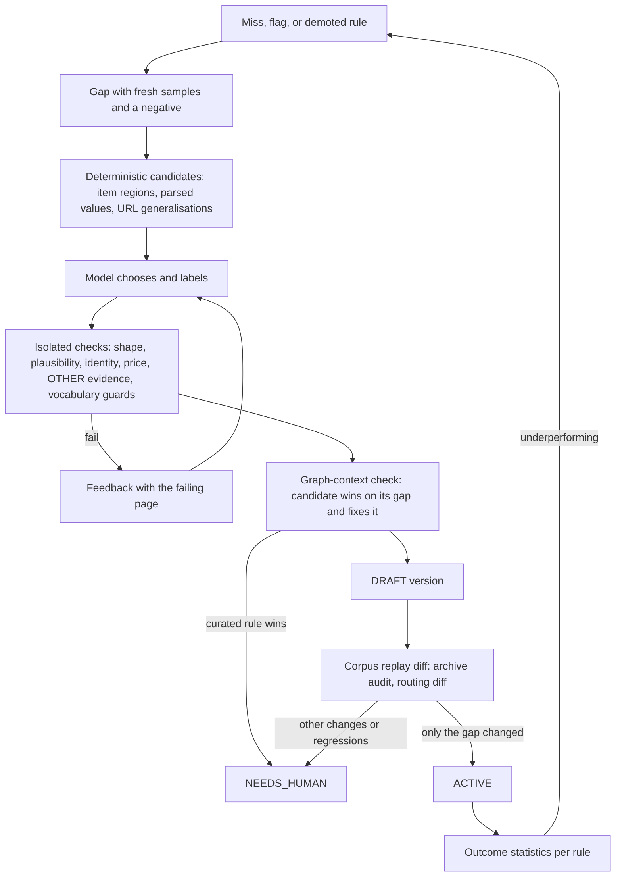
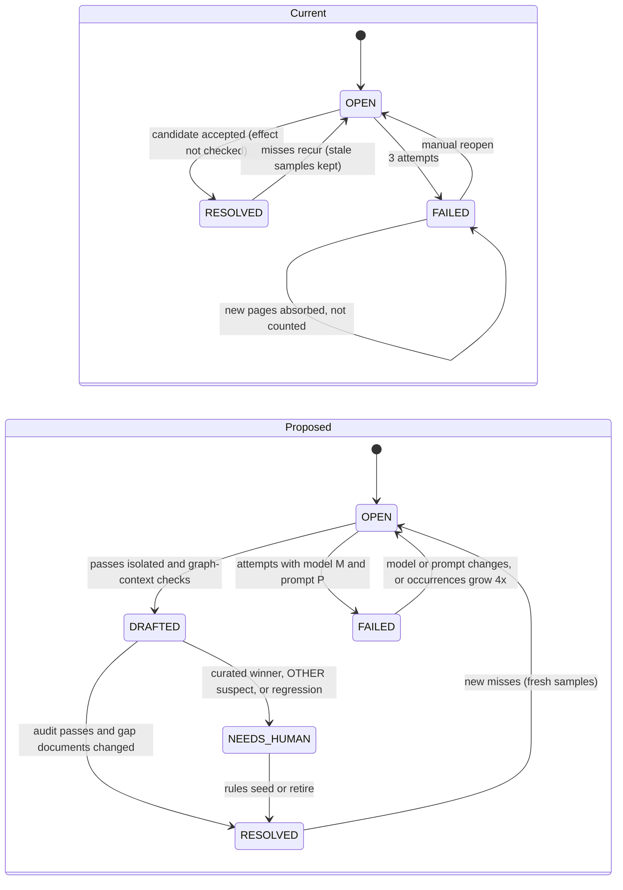

# Rule graphs and LLM induction: review and improvement plan

[Guide index](README.md) · [State machine](wayback-crawler-state-machine.md) · [Performance assessment](wayback-performance-assessment.md) · [Historical sources plan](historical-sources-plan.md)

Review date: **2026-10-03**. Code revision: `52b47f9`. Scope: the rule-graph state
machine and its LLM induction loop, as used to navigate the archive, fetch captures,
parse pages and normalise values. Sources: `olx_eg_wayback`, plus
`dubizzle_eg_wayback` where its configuration differs.

Live figures come from read-only queries and offline replays against the
configured database between 13:00 and 13:15 UTC. A crawl was writing to the
database the whole time, so frontier counts moved between queries. Each figure
gives its own denominator. This review changed no code, rules or data.

## Verdict

The deterministic half of the design is sound and should stay as it is: bytes-only
fetching, offline and graph-pinned parsing, identity and normalisers in code, curated
templates ahead of induced ones, and the offline audit. The **learning half** does
not work yet. Most of what the LLM loop adds is dead, redundant or unchecked. Its
validation checks the model's answers only against the samples the model was
shown, and outside the graph that will execute them. The loop also counts a new
version as progress whether or not it changed anything.

| Measure (live) | Value |
|---|---|
| Navigation rules written by the LLM (graph v111) | **1,313** from 116 calls |
| …that are never the first match for any of 151,318 frontier URL keys | **1,162 (88%)** |
| Matched URL keys covered by rules with *conflicting* decisions | 44,660 of 150,706 (30%) |
| Open navigation gaps with current misses whose prompt samples are all already routed | **531 of 534** |
| Captures parked by one catch-all rule, `\.(olx\.com\.eg)` → DEFER | 41,750 of 131,438 (2019); 19,385 of 54,994 (2020) |
| Extraction answers accepted / later retired as harmful / surviving | 8 of 41 / 5 / **3, all `OTHER`** |
| Surviving induced `OTHER` template swallowing real list pages | 6 pages × 18 adverts |
| Draft values whose classification depends on induced vocabulary | 855 of 2,706 draft occurrences |
| Deferred captures 2016–2019 / with link evidence | **124,497 / 7** |

Recommendation: keep the compiled-rule architecture, but change the method. Today
the loop runs "model proposes → plausibility check on a few samples → activate
globally". It should run "deterministic candidates → model labels → validate in
graph context → staged promotion through a corpus diff → outcome statistics".
Spend the LLM budget on extraction for 2016–2019 first: those unparsed list pages
are what hold back navigation.

## The loop under review

What the model decides at each stage, and what checks its answer:

| Stage | Model decides | Checked by validation | Not checked |
|---|---|---|---|
| Navigating | URL regex → `FETCH`/`SKIP`/`DEFER`, page kind, fetch priority | Regex compiles; matches ≥1 sample of its group; group coverage ≥50%; not ≥90% of batch samples when ≥4 groups | Whether the samples are current; whether the rule wins under first-match order; whether the decision is right |
| Fetching | Nothing (claims, retries, rate gate are code) | — | — |
| Parsing | Page kind, conditions, item selector, field recipes, links | Conditions hold on primary + ≥60% of samples; ≥2 items; ≥60% valid; empty fields; URL/price/detail-identity checks; gold on matched gold pages | Whether it wins inside the graph; effect on other designs; anything for `OTHER`; negative pages |
| Normalising | Global vocabulary; template policy knobs (rental basis default, title price, strictness, identity pattern) | Patterns compile; values are enum members; no vocabulary misses on the samples | Effect on other templates; degenerate patterns; precedence against curated entries |

Both "state machines" are flat: every learned node hangs off `root`, and no `BRANCH`
node has ever been induced. Navigation returns the first matching route in
insertion order. Extraction runs every matching template and ranks the results
(curated, then most adverts, then most detail values). Two consequences shape most
of the findings below:

- Precedence comes from version history.
- The validator never evaluates a candidate under the semantics that will execute it.

## What works and should be kept

- The pipeline invariants hold. `parse()` and `discover_links()` never call the model,
  and replaying with the same graph gives the same drafts.
- Identity is source code (`IdentityPolicy`), not induced. The homepage-hash collapse
  found by the earlier assessment cannot recur on OLX.
- Curated templates outrank induced ones, and `rules seed --retire` provides a supersession path.
- `ArchiveAuditService` already replays the whole corpus through any graph and diffs
  against stored rows. It is the right gate, but only curated changes use it.
- Parse reports, exploration samples, link lookups, per-year capture caps and the
  shared rate gate are in place. They are the right building blocks for the fixes below.
- **Fingerprint clustering works.** On real captures, list and detail pages of one era
  are 22–32 bits apart, and captures of one design are 5–8 bits apart. The threshold is 10.
- The curated `#noresults` `OTHER` template is correct: none of its 83 pages contains a
  single advert link.
- Routing cost is acceptable for now: 1.9 ms per URL key with 1,314 edges, about 5
  CPU-minutes per full pass. It grows linearly with rule count.

## Findings

| ID | Stage | Finding | Severity |
|---|---|---|---|
| N1 | Navigating | Gaps keep stale samples, so the model rewrites rules for URLs already routed | High |
| N2 | Navigating | Validation ignores first-match order: rules shadow each other across groups | High |
| N3 | Navigating | Breadth guard is weak; one catch-all now parks a third of new years' captures | High |
| N4 | Navigating | No outcome feedback: route decisions and LLM fetch priorities are never scored | Medium |
| N5 | Navigating | DEFER depends on extraction; it is a dead end where extraction fails | High |
| X1 | Parsing | `OTHER` is an unvalidated sink | High |
| X2 | Parsing | Candidates are validated alone, never in the graph or against other designs | High |
| X3 | Parsing | A `FAILED` gap absorbs every later page of its design | Medium |
| X4 | Parsing | Oldest-first scan windows will starve newer documents | Medium (latent) |
| X5 | Parsing | The model sees one page; its failures match that | Medium |
| V1 | Normalising | Global vocabulary is shared, order-dependent and ungated | High |
| V2 | Normalising | Semantic policy is a per-template choice the model makes | Medium |
| V3 | Normalising | Values carry no precision or inference flag | Low |
| L1 | Loop | "Progress" is a saved version, not a changed outcome | High |
| L2 | Loop | One LLM budget, navigation first | Medium |
| L3 | Loop | The ledger cannot support evaluation | Medium |

### Navigating

**N1. Gaps keep stale samples, so induction runs on a treadmill.**
`TortoiseRuleGapRepository.record` merges samples as `[*row.samples, *samples][:8]`,
which puts old samples first. `reset_open` zeroes counts but never samples. Once a
gap holds eight samples, no new URL ever reaches the prompt. A gap reopens because
*other* URLs of its shape are still unrouted. The model is shown the old, already
routed ones and writes the same rule again. The validator checks that rule
against the same stale samples, so it passes, and the gap is marked `RESOLVED`
while the real misses stay unrouted.

- Live: 531 of 534 open navigation gaps (569 of 572 samples) show the model only
  URLs that an existing rule already routes. `\/electronics-home-appliances\/` exists
  as `nav.v22.6`, `v26.10`, `v27.10` and `v28.11`. 1,162 of 1,313 rules never win.
- Cost: 116 navigation calls (405k input tokens) yielded 151 live rules.

**N2. Navigation validation ignores first-match order.** `_validate_nav` scores each
group with its own rules only, then appends the whole batch in answer order. A rule
for group 1 can shadow a valid rule for group 2 with a different decision.

- Reproduced offline. A batch `{group 1: -cat-\d+ → SKIP, group 2: -cat-367 → FETCH}`
  is accepted, both gaps are resolved, and the property list URL now routes to `SKIP`.
- Live: 30% of matched URL keys are matched by rules that disagree. Insertion order
  alone decides them.

**N3. The breadth guard is weak.** `NavRuleProposal` rejects only literal patterns such
as `.*`. The 90% check applies only to batches of four or more groups, and only to
that batch's (stale) samples.

- `nav.v42.11` was induced for city landing pages (`*.olx.com.eg/|d0|q:v`). Its
  pattern, `\.(olx\.com\.eg)`, matches every `www.` and subdomain URL.
- Since v42, any such URL that no earlier rule matches is parked as `DEFER` instead
  of becoming `UNROUTED`. It never becomes a gap, so the model is never asked about it.
- As enumeration of later years ran during this review, the rule absorbed 41,750
  captures from 2019 and 19,385 from 2020 (2020 has zero `UNROUTED`). Only 23 of its
  40,120 URL keys are strictly property-worded, so the direct loss is small. The
  real damage is that it switched off navigation learning for the densest years.

**N4. Route decisions get no feedback.** Nothing compares a rule's decision with what its
fetched pages turned out to be. `archive explore` measures false negatives, but
nothing consumes the result. `rule_stats` was planned in
[the historical plan](historical-sources-plan.md#23-postgres-schema) but never built.
Meanwhile, the model's guessed `priority` directly orders a bounded fetch budget.

**N5. DEFER is a dead end where extraction fails.** A deferred advert is fetched only
after a *recognised* list page links to it.

| Year | Deferred | With evidence | List pages parsed | List pages unrecognised |
|---|---:|---:|---:|---:|
| 2013 | 2,281 | 496 | 97 | 0 |
| 2016 | 4,518 | 0 | 0 | 9 |
| 2017 | 17,767 | 7 | 2 | 13 |
| 2018 | 19,725 | 0 | 4 | 11 |
| 2019 | 82,487 | 0 | 1 | 3 |

The state machine does not notice that deferral has no way forward for a
period, and so it does not escalate. The binding constraint for 2016–2019 is
extraction of era B/C list pages, not more navigation rules.

### Parsing

**X1. `OTHER` is an unvalidated sink.** `_validate_template` returns success for an `OTHER`
proposal as soon as its conditions match. An `OTHER` page is `PARSED` with no listings
and no links, and `_needs_review` never flags it. It is therefore never a gap again,
even when routing sent it as a list page (`hint_mismatch`).

- Reproduced offline: an `OTHER` proposal guarded by `#the-list` on the 2013 list
  fixture is accepted, and the page becomes `PARSED` with 0 listings.
- Live: the only induced extraction templates still active are three `OTHER`
  templates. One of them, `tpl.v5.olx_mobile_empty_2013` (guard: any `table` plus
  the text "OLX Mobile", which page footers carry), holds 11 list-routed pages.
  Six of those contain 18 distinct advert links each, e.g.
  `vacation-rentals-cat-388-ig` and `shops-for-rent-sale-cat-415-ig`.

**X2. Candidates are validated alone, never in the graph.** `evaluate_candidate` runs the
proposal by itself. There are no negative samples, and the only check across designs
is gold regression on gold pages the candidate happens to match. `archive audit` is
documented as "the gate for every rule change", but induction activates without it.
Two consequences follow:

- A template that can never win is accepted. Reproduced offline: a list page whose
  curated winner is flagged produces a gap. The model's valid template is accepted,
  but the curated one still wins, so the page stays flagged and the gap reopens.
  The next round's identical prompt is answered from the ledger at zero LLM cost.
  Each round adds a dead template and a new version, which in turn triggers
  `reparse_stale` over up to 10,000 documents. Live exposure: one flagged document,
  under curated `olx.c_2019_list`.
- A template that is too broad can win on *other* designs through richness ranking,
  and nothing measures it.

**X3. A `FAILED` gap is a black hole.** `collect_extraction_gaps` clusters every new
document against all gap fingerprints, `FAILED` ones included, and
`record` on a `FAILED` row does nothing. Reproduced offline: after three failures, a
new capture of the same design joins the `FAILED` gap with no change in count, and
`induce()` makes zero calls. Only a manual `rules gaps --reopen-failed` recovers it,
and nothing reports that the gap is still growing.

**X4. Oldest-first windows will starve new documents.**
`TortoiseRawDocumentRepository.list_by_status` orders by `fetched_at` with a limit.
Gap collection scans 500 `UNRECOGNISED` plus 500 `PARSED` documents,
`reparse_unrecognised` 500, and `reparse_stale` 10,000. Once the oldest window fills
with documents that will never change (the `FAILED` designs of X3), newer designs
can never become gaps. This is latent at 440 documents, but the 2016–2019 breadth
pilot will cross it.

**X5. The model sees one page.** The prompt renders only `samples[0]`; the other
samples are used only to reject. The errors on the live open gaps match this:
"items selector found 1 element" (3 gaps), "conditions held on only 1 of N pages"
(2), a missing sale/rent vocabulary entry (1), and an empty `external_id` (1).

### Normalising

**V1. The global vocabulary is shared, order-dependent and ungated.** Vocabulary
proposed with a template is merged into `graph.vocab`, which every template uses.
`RuleSeedService.plan` appends curated entries *after* the induced ones, and
`_vocab_lookup` falls back to the first match in list order. The live graph puts
induced `rent|rental|…`, `sale|بيع` and `sale|بيع|Development` (no word boundaries)
ahead of the curated patterns.

- Replaying every archived page through the active graph with curated vocabulary
  only changes 331 listing types and 524 property types across 2,706 draft
  occurrences. The effect cuts both ways:
  - 295 shop adverts "for sale" under the category "Shops for Rent - Sale" are SALE
    only because an induced `sale` makes that category ambiguous. The curated
    `for[- ]sale` alone labels them RENT. The "Rent - Sale" safeguard described in
    the state-machine guide depends on that induced entry.
  - An induced `house` makes "Houses - Apartments" ambiguous, which moves 299 drafts
    from APARTMENT to OTHER.
- No gate measured either effect.
- Degenerate entries pass. Reproduced offline: `{"pattern": ".", "value": "SALE"}` is
  accepted into the global vocabulary. Run through the engine, "Land in Safaga over
  the sea", which is correctly dropped today, becomes SALE. "Villa for rent in
  Gouna" also becomes SALE: its title matches both values, so the location text
  decides, and the catch-all matches that.

**V2. Semantic policy is a per-template choice the model makes.**
`default_rental_price_type` (default `PER_MONTH`), `allow_title_price` (default
true), `strict_classification` and `identity_url_pattern` are fields in the model's
schema. An induced Dubizzle template gets monthly rent unless the model opts out,
which contradicts the [Dubizzle mapping contract](dubizzle-eg-wayback-plan.md#mapping-contract).
`dubizzle_eg_wayback` has no `identity_policy()`, so induced templates there fall
back to template ids or `u:` hashes.

**V3. Values carry no precision.** A yearless date anchored to the capture year, a
relative date, a unit-less area (assumed m²) and an exact value are stored
identically. Only the `_raw` text records the difference. The earlier assessment
raised this, and it is still open.

### The loop

**L1. "Progress" is a saved version.** `ArchiveCrawlService.crawl` continues while a
round fetches something *or saves a version*. Combined with X2, `crawl --rounds 0`
with an empty queue has no exit: cached answers cost no budget, and every round
saves a new dead version and re-parses the corpus. This follows from the code and
from reproduction E's per-round behaviour; the loop was not run end to end. Gap status is also not a
backlog: collection runs only when LLM budget remains. The 7 open extraction gaps
read 0 occurrences while 40 documents are `UNRECOGNISED`.

**L2. One budget, navigation first.** `--max-llm-calls` is spent on navigation before
extraction. Live, 116 navigation calls (12% of their rules live) went in ahead of
41 extraction calls, although extraction is the bottleneck (N5).

**L3. The ledger cannot support evaluation.** `_ask` stores message roles and character
counts, not the prompts. It records no gap or graph version, and 33 rejected
extraction decisions carry no source. Prompt or model changes therefore cannot be
replayed or compared offline. The historical plan's exit test (hide one era and
let induction rebuild it) has not been run.

## Target methodology

Five principles, each tied to the findings:

1. **The corpus decides, not the samples** (N1–N3, X1–X2, V1). Every candidate is
   evaluated on fresh positive samples, on negatives, and in graph context. It is
   then promoted only through a replay diff: it must change outcomes for its gap and
   nothing else, unless that is reviewed.
2. **Deterministic candidates, LLM labels** (X5). Code finds repeated advert regions,
   parses candidate values with the normalisers, and generalises URL sets. The model
   chooses and names among checkable options instead of writing everything blind.
3. **Semantics are source policy** (V1–V2). Identity, rental basis, title-price use,
   classification strictness and vocabulary precedence belong to the source, as
   identity already does. Templates may tighten them, never loosen them.
4. **Rules are hypotheses with measured outcomes** (N4–N5). Every route and template
   accrues statistics from what actually happened. Rules that underperform become
   gaps carrying their evidence.
5. **Measure the method** (L3). Track acceptance, survival, liveness and effect per
   LLM call, per era, plus offline evaluation of prompts and models.

Gap lifecycle, current and proposed:

## Plan

Each item names its files, a test built from the reproductions in this review, and
its acceptance criterion. Phases 0 and 1 are small and independent; do them before
the 2016–2019 breadth pilot.

### Phase 0: make induction honest

| # | Change | Fixes | Acceptance |
|---|---|---|---|
| 0.1 | **Fresh samples.** `record()` puts this scan's samples first; navigation induction re-reads the gap's *current* `UNROUTED` URLs at prompt time. A rule that routes none of them is rejected as dead on arrival. Files: [repositories/rules.py](../core/src/realestate/infrastructure/db/repositories/rules.py), `InMemoryGaps`, `_validate_nav` in [rule_induction_service.py](../core/src/realestate/application/services/rule_induction_service.py) | N1 | A gap whose stored samples are routed prompts only with unrouted URLs; replaying the live gap table produces no rule for the 531 stale gaps |
| 0.2 | **Navigation in graph context.** Route every batch sample through `graph.extended(batch)`; a group counts as covered only where one of its own rules wins; reject shadowed rules and cross-group decision conflicts. Catch-all guard: route a stratified sample of current `UNROUTED` keys across shapes and reject a rule that captures more than a few shapes beyond its group. Replace the literal triviality list | N2, N3 | Reproduction A is rejected with feedback; a `\.(olx\.com\.eg)`-style rule is rejected |
| 0.3 | **Extraction in graph context.** After the isolated checks, run `engine.extract(candidate_graph, sample)`; accept only if the candidate wins on the primary sample and the gap's own criterion improves (unrecognised → recognised, flagged → clean). If a curated template wins, set the new gap status `NEEDS_HUMAN` with its key and parse report and make no further calls | X2 | Reproduction E creates no version and leaves a `NEEDS_HUMAN` gap naming the curated template; the live `olx.c_2019_list` document surfaces there |
| 0.4 | **`OTHER` needs negative evidence.** Reject an `OTHER` proposal when a matched sample has ≥3 advert-shaped links or ≥3 currency-marked price texts. Add `IdentityPolicy.advert_patterns` for advert URLs whose id is untrusted (OLX i2 `-ID[0-9A-Za-z]+\.html`). `_needs_review` flags `OTHER` documents with advert links | X1 | Reproduction B is rejected; on the live corpus the 6 gallery pages under `tpl.v5` are flagged and none of the 83 `#noresults` pages is |
| 0.5 | **Vocabulary guards** (stopgap until 5.2). Reject entries that match >25% of a fixed neutral text set; wrap Latin alternatives in `\b`; minimum length 3 | V1 | Reproduction C is rejected; the live induced `rent` entry becomes `\brent\b` |
| 0.6 | **`FAILED` gaps keep counting.** `record` adds occurrences and samples to `FAILED` rows without reopening them; store the model and prompt version on the gap; reopen automatically when either changes or occurrences grow 4×; report growth in `archive status` | X3 | Reproduction D counts the second page; bumping `TEMPLATE_PROMPT_VERSION` reopens the gap |
| 0.7 | **Progress means effect.** A round without fetches or new captures counts as progress only if a new version changed outcomes (reparse recognised documents or created/updated listings; reroute changed a URL's status). Collect gaps even with zero LLM budget, so gap counts stay a backlog | L1 | `crawl --rounds 0` on an empty queue stops after one round |
| 0.8 | **Full scans.** Keyset-paginate gap collection, `reparse_unrecognised` and `reparse_stale` over all candidates instead of the oldest fixed window. Files: [raw_document.py](../core/src/realestate/infrastructure/db/repositories/raw_document.py), [ingestion_service.py](../core/src/realestate/application/services/ingestion_service.py) | X4 | With 600 unrecognised documents, where the oldest 500 belong to one `FAILED` design, the newer design becomes a gap |

Reproductions A–E become the regression tests for 0.2–0.7. They need only the
existing `Harness` in `tests/test_rule_induction_and_crawl.py`, fixtures, and a
scripted model; all five fail today as described above.

### Phase 1: repair the stored graphs

1. **Compact navigation.** Replay the active graph over all URL keys and save a revision
   without the dead rules, exact duplicates and `nav.v42.11` (`RuleGraph.revised(remove=…)`).
   Add a reroute command that sends captures routed by removed nodes back to
   `DISCOVERED`. Today only `UNROUTED` and capture-capped rows can be reopened. With 0.1
   and 0.2 in place, those captures become fresh gaps. Acceptance: a stored routing diff
   in which only the removed rules' captures change; about 150 live rules remain.
2. **Retire `tpl.v5.olx_mobile_empty_2013`** and add a curated template for the 2013
   `-ig` gallery variant that it hides. Acceptance: the 6 pages yield their adverts, and
   `archive audit` shows no other change.
3. **Fix the curated vocabulary, then decide each induced entry.** Make the curated SALE
   pattern match `\bsale\b`, so "Rent - Sale" categories are ambiguous without help.
   Keep or retire each induced entry based on the audit diff. Acceptance: with curated
   vocabulary alone, the 295 shop adverts stay SALE; the diff is stored with the version.

### Phase 2: staged promotion through the audit

1. Save induced extraction versions as `DRAFT` (`RuleGraphStatus.DRAFT` exists but is
   unused). Promotion runs `ArchiveAuditService.audit(graph=candidate)` against the
   active graph and promotes automatically only when all of the following hold:
   - outside the gap's own documents, no document changes winner or loses listings;
   - no listing changes id, type, price or area;
   - no new identity collision appears;
   - no list- or detail-routed page newly becomes `OTHER`;
   - the gold score does not fall.

   Otherwise the draft is kept with its report, behind new `rules drafts` and `rules
   promote` commands. The audit took 2.2 s for 340 documents, so it stays under a
   minute to roughly 10k. Beyond that, audit the gap's cluster plus a stratified
   sample per template.
2. Do the same for navigation: replay the candidate over a stratified sample of
   20k URL keys and promote automatically only when just `UNROUTED` keys change.
3. Link each version to its stored diff, so `rules show` explains why it is active.

### Phase 3: deterministic candidates, LLM labels

1. **Item regions.** Find repeated sibling groups (same signature, ≥3 members) that contain
   advert-shaped links, and JSON arrays whose objects carry id-like keys. Offer the top
   three to the model as numbered options. This targets "items selector found 1 element".
2. **Field candidates.** Inside the chosen items, run the normalisers over every text node
   and attribute. Show "selector → parsed value" pairs (price with currency, area with
   unit, dates, counts). The model maps fields; the code checks the parsed values.
3. **Several pages per prompt.** Show 2–3 sample skeletons plus one near-miss negative
   from the nearest other design. This targets "conditions held on only 1 of N pages".
4. **Navigation from outcomes.** Label fetched captures by extraction outcome (adverts or
   not) and generalise URL patterns per shape deterministically. Use the model only for
   shapes with no labelled captures, and default unknown shapes to `DEFER` plus a small
   probe fetch, never `SKIP`.

### Phase 4: close the loop

1. **`rule_stats`** per graph version and node, derived from data already stored
   (`crawl_frontier.route_node`, `raw_document.parse_report`):
   - routes: queued, fetched, and the outcome mix (adverts, `OTHER`, unrecognised, failures);
   - templates: documents won, items, drops by reason, identity problems, hint mismatches.

   Expose them through `rules show --stats`.
2. **Demotion.** A gap with evidence opens when:
   - a route's fetched pages are ≥90% `OTHER` (n ≥ 20);
   - exploration finds adverts behind a `SKIP` or `DEFER` rule;
   - a template's hint-mismatch rate is high, or it returns `OTHER` on pages with advert links.
3. **Evidence-supply monitor.** Per capture year, compare deferred captures with
   recognised list pages. Where many captures are deferred but no list page is
   recognised, as in 2016–2019 today, prioritise that period's extraction gaps
   and queue a small probe of deferred detail captures. Report it in `archive coverage`.
4. **Separate budgets** for navigation and extraction. Spend on extraction first while the
   monitor reports starved years. Acceptance for this phase: 2016–2019 list pages are
   recognised (curated or induced) and their deferred adverts gain evidence before the
   breadth pilot scales up.

### Phase 5: normalisation policy and provenance

1. **`ArchiveDataSource.extraction_policy()`** beside `identity_policy()`. It sets the
   rental-basis default, title-price permission, classification strictness and the
   identity URL requirement. Templates can only tighten these, and the knobs leave the
   LLM schema. Give `dubizzle_eg_wayback` an identity policy (numeric `-ID(\d+)\.html`).
2. **Vocabulary scoped and ordered by origin.** Curated entries come first. Induced
   entries stay template-scoped (the template's own `vocab`) unless promoted through
   Phase 2 or `rules seed`.
3. **Value precision.** Record date precision (exact, anchored-yearless, relative) and
   assumed units or currency as `_`-prefixed attributes, which the content hash excludes.

### Phase 6: measure the method

1. **Ledger.** Store the full prompt (content-addressed), `gap_id` and `graph_version`;
   make `source_key` mandatory.
2. **Offline evaluation.** Freeze gap suites, for example by hiding one curated OLX era or
   using the Dubizzle fixtures. Replay them through prompts and models with the real
   validator and the Phase 2 audit. Report acceptance, survival, effect and tokens.
3. **Per-era metrics** in `archive status`: LLM calls per 1,000 documents, acceptance,
   survival, liveness and effect per call. Current baselines are below.

| Domain | Acceptance | Live or surviving | Note |
|---|---:|---:|---|
| Navigation | 110 / 116 (95%) | 151 / 1,313 rules (12%) | High acceptance, low liveness: N1–N3 |
| Extraction | 8 / 41 (20%) | 3 / 8 templates | All three survivors are `OTHER`; one drops adverts |

### Order of work

| Order | Items | Why | Size |
|---|---|---|---|
| 1 | 0.1, 0.2 | Largest waste, and the catch-all is still absorbing new years | S–M |
| 2 | 0.3, 0.7 | Stops dead versions and the endless loop | S |
| 3 | 0.4, 1.2 | The only active induced extraction rules; one drops adverts | S |
| 4 | 0.6, 0.8 | Latent starvation before the pilot | S |
| 5 | 1.1, 1.3 | Clean baseline before measuring anything else | M |
| 6 | 4.3, era B/C list templates | Unblocks 124k deferred captures | M |
| 7 | Phase 2 | Turns the Phase 0 checks into a systematic gate | M |
| 8 | Phase 5 | Stops semantic drift through templates | M |
| 9 | Phase 3 | Raises extraction acceptance | L |
| 10 | 4.1, 4.2, Phase 6 | Closes the loop and measures the method | M–L |

## Measurement notes

- **Navigation replay.** Built the active graph (v111) from `rule_node`/`rule_edge`,
  then called `HtmlRuleEngine.route` on 3,000 random URL keys for timing. Each
  `url_regex` edge was also matched against all 151,318 distinct frontier URL keys:
  a rule is *dead* when it is never the first match, and a *conflict* is a key matched
  by rules with different decisions. By the end of the review the graph had reached
  v115.
- **Stale samples.** Compared each open gap's stored samples with the current
  `crawl_frontier` status of their URL keys.
- **`OTHER` evidence.** Counted distinct advert ids among each archived page's links
  with `OLX_EG_IDENTITY`, excluding the page's own id. The i2-era base62 ids are not
  trusted by that policy, so 2016–2021 pages read 0. Item 0.4 adds patterns for them.
- **Vocabulary.** Ran `HtmlRuleEngine.extract` over every archived OLX page with the
  active graph, and again with its vocabulary replaced by the curated `templates.json`
  vocabulary. Drafts were compared by external id.
- **Fingerprints.** Compared all pairs of fixture pages; synthetic Dubizzle shells were
  excluded from the conclusion.
- **Offline reproductions A–E.** Used the real services wired to the in-memory
  repositories of the test suite, with a scripted model. No database and no network.
