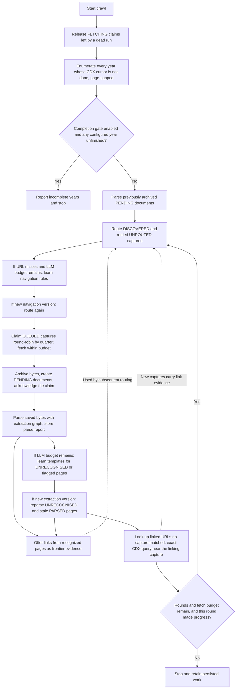
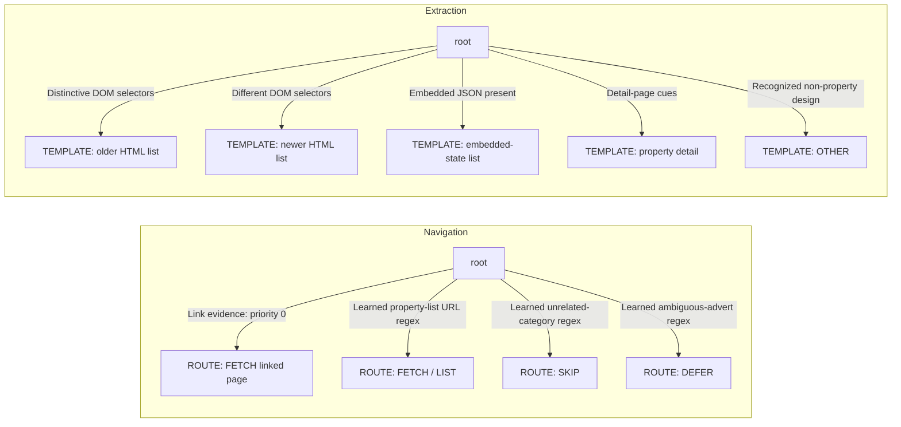
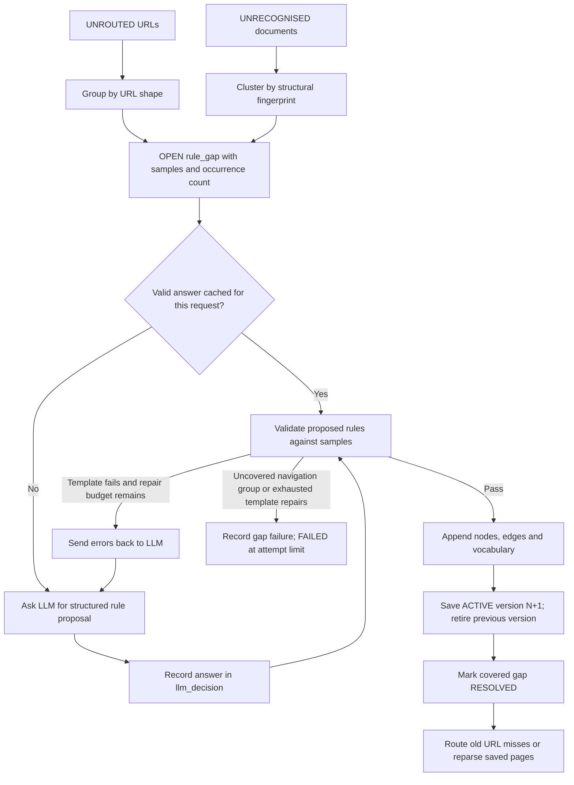
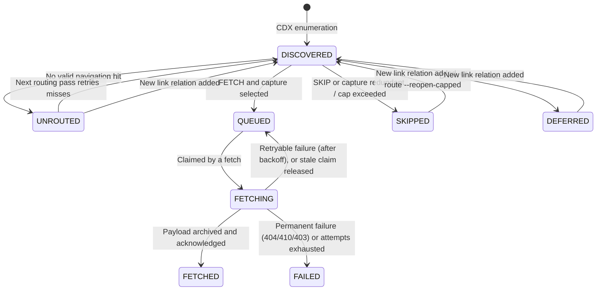
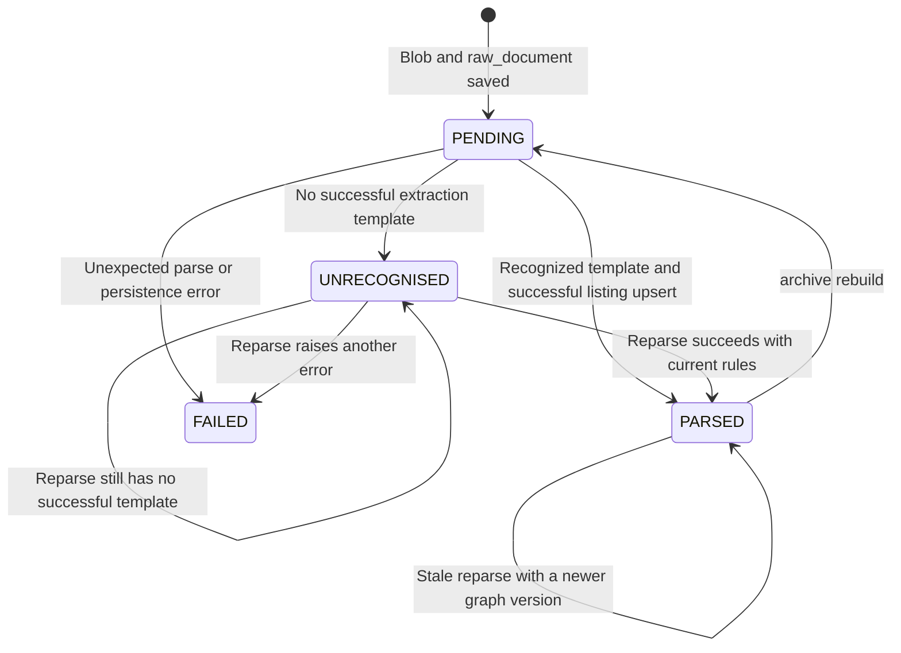

# How the Wayback OLX crawler's state machine works

[Guide index](README.md) · [Data sources](sources.md) · [Operations](operations.md)

For measured behavior and data-quality limitations in the configured database,
see the [2026-10-03 performance assessment](wayback-performance-assessment.md)
and its "Status after fixes" section. Successful workflow states alone do not
establish extraction accuracy or coverage across years; `archive audit` and
`archive coverage` measure both (see [Measuring quality](#measuring-quality)).

The historical OLX crawler learns reusable rules for deciding **which archived
pages to fetch** and **how to extract property adverts from them**. It asks an
LLM about inputs it cannot handle, validates the answers, and stores successful
rules for later use. Listing values come from deterministic code reading
archived bytes; the model proposes extraction recipes.

Two things are deliberately **not** induced, because an induced mistake in
either passes every plausibility check while corrupting data: the source's
**identity policy** (which part of an advert URL is its id) and **curated
templates** for page designs already understood, installed with `rules seed`.

This guide describes the current implementation, rather than the proposed design
in [the historical sources plan](historical-sources-plan.md). The source is
`olx_eg_wayback`, with default domain `olx.com.eg` and years **2010–2023**. Domain
and year bounds can be overridden through source parameters.

## Three kinds of state

There are two rule graphs and a separate workflow lifecycle. Keeping them apart
makes the crawler easier to follow:

| State | Input | Question it answers | Stored in |
|---|---|---|---|
| Navigation graph | Original URL + link evidence | Fetch, skip, or wait? | `rule_graph`, `rule_node`, `rule_edge`, domain `NAVIGATION` |
| Extraction graph | Archived HTML + URL + capture time | Which recipe recognizes this page and extracts its adverts? | Same tables, domain `EXTRACTION` |
| Workflow statuses | Capture or saved document | What work has been completed or is waiting? | `crawl_frontier.status`, `raw_document.status` |

A rule-graph walk starts at `root` for **each input**. It does not retain a current
node between pages. The frontier and raw-document statuses provide the persistent
progress between rounds and process restarts.

## The complete loop



[ArchiveCrawlService.crawl](../core/src/realestate/application/services/archive_crawl_service.py)
coordinates these steps. Fetching finishes before the ingestion service parses
that batch. A round counts as progress if it attempts fetches, saves a new
navigation/extraction version, or adds captures through link lookups. The dashed link represents data fed back to later
routing, rather than another routing pass during parsing.

## What is actually constructed?

A [`RuleGraph`](../core/src/realestate/domain/rules.py) contains:

- **Nodes:** `ROOT` and optional `BRANCH` nodes organize decisions; `ROUTE` and
  `TEMPLATE` nodes carry terminal actions.
- **Edges:** a source node, destination node, JSON condition, and evaluation
  priority. Lower edge priority is evaluated first; insertion order breaks ties.
- **Versioned vocabulary:** regex mappings such as Arabic/English phrases to
  `SALE`, `RENT`, or property types.

The graph walker supports branches, walks depth first, and guards against cycles.
The current induction code appends new terminal nodes directly to `root`, so the
learned graphs normally look like a growing set of guarded alternatives:



The learned branches above are illustrative, not a fixed set of production
rules. Navigation patterns are induced from the pages encountered. Extraction
mixes both origins: the curated OLX templates in
[`olx_eg_wayback/templates.json`](../core/src/realestate/infrastructure/sources/olx_eg_wayback/templates.json)
(one per known page design, `HUMAN` origin, installed by `rules seed` ahead of
every other edge) plus whatever induction learns for designs none of them match.

### Navigation: first valid route wins

The navigation graph initially has just one generic seed rule:

```json
{
  "condition": {
    "type": "evidence",
    "key": "linked_as",
    "in": ["DETAIL", "LIST", "PAGINATION"]
  },
  "action": {
    "decision": "FETCH",
    "priority": 75,
    "page_kind": "FROM_EVIDENCE"
  },
  "edge_priority": 0
}
```

This is a compact explanation of the seed edge and node, not a graph import
format. `FROM_EVIDENCE` resolves to `DETAIL` when the evidence contains that role,
otherwise `LIST`. Without evidence or a learned URL rule, navigation returns a
miss and the captures become `UNROUTED`.

[`HtmlRuleEngine.route`](../core/src/realestate/infrastructure/extraction/engine.py)
returns the first reachable `ROUTE` node whose action yields a valid decision:

| Decision | Effect on discovered captures |
|---|---|
| `FETCH` | Queue selected captures; skip redundant/excess captures |
| `SKIP` | Mark them `SKIPPED` |
| `DEFER` | Mark them `DEFERRED`, waiting for link evidence |
| No valid route | Mark them `UNROUTED`, eligible for induction |

**Two priorities have different meanings.** An edge's priority controls which
rule is tried first, with lower numbers first. A route action's priority controls
fetch order, with higher numbers first. Queued captures are then ordered by
timestamp and ID. The seed's edge priority of zero gives evidence precedence
over subsequently learned URL rules.

### Extraction: prefer curated, then the richest successful template

Without `rules seed`, extraction starts with a root-only version-zero graph, so
every document is initially a miss. Conditions can inspect distinctive CSS selectors, text regexes,
embedded JSON paths, capture dates, URL regexes, DOM fingerprints, and spaCy token
patterns; `all`, `any`, and `not` combine conditions. Navigation only has URL and
evidence context, while extraction has the archived document and capture time.

For example, the 2023 reference fixture recognizes `state` JSON containing
`algolia.content.hits`. Its template iterates those hits, reads fields such as
`title` and `externalID`, and builds advert URLs. Older fixture templates iterate
HTML list rows instead. These are alternative recipes for different page designs;
the default year range does not hard-code an era-to-template mapping.

An extraction action defines its page kind (`LIST`, `DETAIL`, or `OTHER`), item
selector or JSON path, field recipes, link recipes, and optional default currency.
Field recipes support selectors, attributes, regexes, embedded JSON, constants,
and fallbacks. Normalizers convert the extracted text into typed listing drafts.

The engine tries **all reachable matching templates**:

1. Malformed templates and those yielding no valid adverts fall through.
2. `OTHER` is a successful recognition with zero adverts and no outgoing links.
3. A successful curated (`HUMAN`/`SEED`) template beats any induced one:
   populated fields do not prove an induced recipe right.
4. Then most valid adverts wins; ties go to the template filling most detail
   values (price, area, rooms, listed date, URL, description, city, coordinates),
   then traversal order.

Field values then pass through fixed rules the template cannot override:

- **Identity.** With the source's identity policy (OLX: `-iid-(\d+)`, numeric
  `-ID(\d+).html`, ...), an advert URL's id is authoritative. A template's own
  id must agree with it, or the item is dropped as an identity conflict. A
  whole-page `url` that is the site home or a category page falls back to the
  archived page URL, and the template is flagged. No URL hash ever stands in
  for a site root.
- **Price.** If a price regex captured something without an amount (the dot in
  `ج.م125,000`), the whole cell text is parsed instead when it carries a
  currency marker; `_raw.price_source` records `field`, `field_fulltext` or
  `title`. Placeholders (`ج.م1`) stay unknown.
- **Places.** Cities come from a curated alias table matched on whole names
  (`al-Bah̨r-al-Ah̨mar` → Red Sea), never by splitting on hyphens. A country
  name is not a city, and foreign place names in titles are flagged.
- **Sale or rent.** A text naming both (`Shops for Rent - Sale`) is skipped in
  favor of the next decisive text, and the first match is used only when none
  is decisive.

This lets a richer later template handle a design already matched by an earlier,
less complete template, without letting it displace a curated one. If nothing succeeds, `parse()` raises
`UnrecognisedDocumentError`; ingestion saves `UNRECOGNISED` for later induction.
That is distinct from an unexpected parsing/storage error, which produces `FAILED`.

## How misses become new graph states

[`RuleInductionService`](../core/src/realestate/application/services/rule_induction_service.py)
groups misses so it can learn one reusable recipe from several related inputs:



Navigation asks about batches of URL-shape groups. Extraction provides a trimmed
view of an archived page and validates the proposed template on saved samples
from that design, with the source's identity policy and country, exactly as
production parsing does. A new version copies the previous graph and appends
rules; induction does not rewrite existing nodes in place. `rules seed
--retire KEY` creates a version **without** named states, which is how a
faulty induced template is superseded.

Extraction gaps come from `UNRECOGNISED` documents **and** from `PARSED` ones
whose stored parse report shows the winning template malfunctioning (identity
problems, or most items dropped). A wrong-but-populated result is a gap too.

Current default validation and retry behavior:

| Stage | Checks and bounds |
|---|---|
| Navigation | Valid decisions and compilable, nontrivial regexes; each accepted rule must match a sample in its group; the group's accepted rules together must cover at least 50% of samples |
| Navigation breadth | With at least four groups, reject a pattern matching at least 90% of all sampled URLs |
| Extraction conditions | Recognize the primary sample and at least 60% of sampled pages; include a distinctive page-design cue, rather than only a URL/date or generic selector |
| Extraction output | Non-`OTHER` templates need a title; lists need an items recipe and at least two items on the primary sample; primary valid-item ratio must be at least 60%; other matched samples must also succeed |
| Extraction field feedback | Reject missing sale/rent vocabulary, and declared fields empty on every sample: two list pages with ten or more items, or three detail pages (currency excepted) |
| Extraction correctness | Reject regexes escaped twice (`\\d`); a `url` recipe pointing at the site home or a category page; one external id from detail pages of different adverts; a price regex that discards the amount, or price recipes that only ever succeed through the title fallback |
| Gold regression | With verified gold labels for pages the candidate matches, reject it if adding it lowers the exact-match rate on id, title, amount, currency and sale/rent |
| Repairs and failures | Up to two template repair responses after the initial proposal; gaps normally become `FAILED` after three failed induction attempts |

`OTHER` proposals pass after condition validation without listing-output checks.
These are checks on sampled archived pages; they do not establish that a rule
works across every capture. There is no separate human activation gate in this
flow. Saving a validated version activates it immediately in a database transaction
and retires the previous active version for that source and decision domain.

The LLM ledger stores responses, validity, errors, token counts, and latency.
Successful answers can be reused for identical request fingerprints, including
model, prompt version, messages, and response schema. Cached answers do not spend
the crawl's LLM-call budget. Rule nodes link back to the decision that created them.
If new misses recur in a previously `RESOLVED` gap, collection reopens it for
induction. `FAILED` gaps remain excluded from automatic induction.

## Persistent capture and document lifecycles



Navigation routes a URL's discovered captures together, merging link evidence
across captures. Capture selection applies its caps **per capture year**
(defaults: two list captures, one detail, one other/unknown per URL per year), so
every year a URL was archived in can contribute whatever order years were
enumerated in. Within a year it deduplicates CDX content digests and counts
already queued, claimed or fetched digests against the cap; the same content in
another year is still fetched, since it shows the advert was still up. When too
many distinct captures remain, it spreads selections over the year, including
first and last when the budget is at least two. Unselected captures get a
route-node marker ending in `#capture-cap`; `archive route --reopen-capped`
sends them back to routing after a cap change.

Claimed captures are fetched in **stratified order**: round-robin across capture
quarters (highest route priority, then oldest, within each), so a dense month
cannot exhaust a bounded budget. The source parameter `max_fetches_per_quarter`
caps fetched-plus-claimed captures per quarter for breadth pilots.

The document lifecycle starts separately when bytes are archived:



Every parse stores `graph_version` and a `parse_report` on the document: the
winning template and its origin, page kind, items examined and kept, the
reasons items were dropped, identity problems, and `hint_mismatch` (a capture
routed as a list or detail page that came out as something else). Runs, replays
included (trigger `REPLAY`), store the same counters in `scrape_run.stats`, so a
run that "succeeded" while recognizing nothing useful is visible as such.

`FETCHED` describes collection progress, not successful extraction. A fetched
capture can have a raw document that is still `PENDING`, `UNRECOGNISED`, or `FAILED`.
A recognized `OTHER` document becomes `PARSED` even though it produces no listings.
The diagrams show the archive crawl's normal paths; explicit replay commands can
also reprocess already `PARSED` and `FAILED` documents.

## Example: unlocking an ambiguous OLX advert

Suppose CDX contains a property-list URL and `/ad/-ID9v1Io.html`. The latter has
little evidence in its slug about whether it is a property advert.

1. **First round:** learned URL rules fetch the property list and defer the
   ambiguous advert. The list initially becomes `UNRECOGNISED`.
2. **Template induction:** a validated list template is activated. Replaying the
   saved list extracts adverts and discovers the ambiguous URL as a `DETAIL` link.
3. **Evidence feedback:** `FrontierLinkSink` canonicalizes the URL to its CDX/SURT
   key. The repository adds `linked_as: ["DETAIL"]` to matching captures and moves
   reroutable captures back to `DISCOVERED` when that relation is newly added.
4. **Next round:** the priority-zero seed edge matches this evidence before the
   learned defer rule. Selected detail captures become `QUEUED` and are fetched.
5. **Detail parsing:** an existing detail template extracts it, or the same
   induction/replay loop learns its design.

Link evidence can also reopen `UNROUTED` and `SKIPPED` captures. It leaves queued,
fetched, and failed captures in their existing statuses. See the
[end-to-end regression test](../core/tests/test_rule_induction_and_crawl.py).

A link that matches **no** enumerated capture (another host the domain query
missed, a year not yet enumerated) is recorded in `crawl_link_request` with the
linking page's capture time. Each round looks up to `link_lookups_per_round` of
them (detail links first) with one exact-URL CDX query: closest captures first,
within `link_lookup_window_days` of the linking capture, two at most. Found
captures join the frontier with the link as evidence, so the seed rule fetches
them next round. Links outside the source's domain are never looked up, and
failed lookups retry up to three times. `archive lookup-links` runs lookups on
demand, and `archive status` counts pending ones.

## Checking what routing rejected

Routing decisions are never checked against the pages they turned away.
`archive explore --per-year N` queues a reproducible pseudo-random sample of
`SKIPPED`, `DEFERRED` and `UNROUTED` captures per capture year. They get route
node `explore` and the lowest fetch priority. Once fetched, `archive audit`
reports how many held adverts: an estimate of routing false negatives per run of
samples. A different `--seed` draws a different sample. The audit also reports
new adverts per 100 documents for each capture quarter, which shows where
further fetching still pays.

## Capture time, replay, budgets, and restart behavior

CDX enumeration requests HTTP-200 HTML captures using domain matching, including
subdomains. It saves a resume key and completion flag per domain and year in
`crawl_cursor` (scope `cdx:{domain}:{year}`; a pre-existing `cdx:{year}` cursor is
adopted once). Every `crawl` continues any year in the source's range that is not
fully enumerated, up to `enumeration_pages_per_crawl` index pages (or
`--max-enumeration-pages`), whether or not the frontier already has rows.

Replay fetches use `/web/{timestamp}id_/{original_url}`. The client validates each
redirect before following it: requests stay on Wayback, retain original-byte
mode and point to the configured original domain or its `www` variant. OLX also
permits the requested in-domain city subdomain for its older layouts. Every hop
is throttled. An aware `Memento-Datetime` normalized to UTC supplies served time;
otherwise the final replay URL must contain a valid full timestamp. A requested
prefix alone cannot supply time proof. Metadata preserves requested and served
URLs/times, timestamp source, drift and the full redirect chain. Frontier ID,
URL key and CDX digest identify the requested capture; offline parsing uses the
served URL/time. A served year outside the configured source range is held as a
failed frontier entry for review, without emitting an observation. See the
[source metadata contract](sources.md#archive-sources-rule-graphs).

An extraction graph is loaded once per source instance, so parsing and link
discovery share one version. New rules take effect through a new instance on
reparse or the next run. Extracted drafts record the template and graph version,
and use capture time as `observed_at`. Historical observations are retained, each
with a `snapshot` of the complete normalized advert as that capture showed it
(plus its graph version and template). The listing row keeps the newest
observation's main values and merges missing details from other captures; each
merged value's source document is recorded in `attributes._provenance`. See
[the archive source guide](sources.md#archive-sources-rule-graphs).

Documents parse in capture order, so the merged row never depends on storage
order. A new extraction version reparses `UNRECOGNISED` documents **and**
`PARSED` documents parsed by an older version (`parse --stale`).

`--rounds` bounds iterations; zero means continue until idle or the fetch budget
is spent. `--max-fetches` counts selected capture attempts, including failed
fetches and rejected replay provenance, across all rounds. Redirects and retries
are part of an attempt, so it does not count individual HTTP requests.
`--fetches-per-round` controls the attempt budget for each batch. Handled fetch
failures increment the scrape run's errors and produce `PARTIAL` status; output
and logs distinguish attempts, failures and archived payloads. Provenance rejections and permanent failures stay failed; transient failures
return to the queue with backoff. Unattempted rows remain queued.

`--require-complete-enumeration` optionally holds the crawl before parsing,
routing, induction or capture fetches if any configured source year lacks a
completed CDX cursor. The CLI reports the unfinished years and exits with status
2. `archive status` reports completion for the same configured scope. The crawler
resumes incomplete enumeration up to its page budget, even for a nonempty
frontier. Explicit `archive enumerate` can finish it before the next crawl.
`--max-llm-calls` is shared by navigation and extraction, with navigation first.
Exhausting that budget still permits fetching and parsing with existing rules.

At startup, `crawl` parses up to 10,000 leftover `PENDING` documents. After new
templates it reparses up to 500 `UNRECOGNISED` documents by default. Larger backlogs
can be handled through explicit parse commands. Persisted rules and statuses let
later runs continue, but there are several limits:

- New navigation versions automatically retry `UNROUTED`, not all `SKIPPED` or
  `DEFERRED` captures. Those can reopen through newly added link evidence.
- A capture becomes `FETCHED` only when ingestion acknowledges that its payload
  was archived; an archive-write failure sends it back to the queue. Transient
  fetch failures (timeouts, 429, 5xx) wait in `QUEUED` with an exponential
  backoff (10 min, 20 min, ...) until `max_fetch_attempts` (default 3);
  permanent ones (404/410/403) become `FAILED` at once.
- Claims are a status update conditioned on `QUEUED`, so two concurrent fetches
  do not take the same row. Claims older than `claim_timeout_minutes` (default
  15) are released at the next crawl.
- Request spacing is shared: every Wayback client (the source's replay client
  and the CDX client) reserves send slots from one row in `archive_rate_gate`
  under a row lock, so several crawl processes together still keep one
  `min_delay_seconds` between requests. A 429 pushes the shared slot back, pausing
  every worker.
- `FAILED` gaps are not retried automatically; after changing the model or the
  prompts, `rules gaps --reopen-failed` gives them fresh attempts.
- LLM decisions record the source whose induction asked (`llm_decision.source_key`),
  so `archive status` reports one source's calls and tokens.

## Measuring quality

Run from `core/`. Nothing here writes listings unless stated.

```bash
# Replay every archived page offline through a graph and measure it: blob
# integrity, page kinds, dropped items and why, identity collisions, field
# completeness, a diff against stored rows, and the gold score.
./venv/bin/python -m realestate.cli archive audit --source olx_eg_wayback [--graph-version N]
# What exists vs. what was decided, per year and quarter.
./venv/bin/python -m realestate.cli archive coverage --source olx_eg_wayback
# Install curated templates (audits the candidate first; --dry-run stops there).
./venv/bin/python -m realestate.cli rules seed --source olx_eg_wayback --dry-run
./venv/bin/python -m realestate.cli rules seed --source olx_eg_wayback --retire tpl.v4.example
# Apply a new graph to already-parsed documents, or rebuild a source entirely
# (deletes its listings and re-parses every archived payload in capture order).
./venv/bin/python -m realestate.cli parse --source olx_eg_wayback --stale
./venv/bin/python -m realestate.cli archive rebuild --source olx_eg_wayback --dry-run
./venv/bin/python -m realestate.cli archive rebuild --source olx_eg_wayback --yes
# Pre-filled, unverified gold labels from real captures, to check by hand.
./venv/bin/python -m realestate.cli archive gold-export --source olx_eg_wayback --sample 12
```

Reports land in `var/audit/` (ignored by git). Gold labels live in
`var/gold/<source>/*.json` and count only once `"verified": true`; they point at
blobs, so no HTML leaves the blob store. Committed test labels are under
[`tests/fixtures/wayback_olx_eg/gold/`](../core/tests/fixtures/wayback_olx_eg/gold/).

## Inspect the constructed graphs

Run these commands from `core/` using the configured database. `show` and `status`
inspect the rules and progress actually stored there; the diagrams in this guide
explain their structure rather than reporting a particular database's contents.

```bash
./venv/bin/python -m realestate.cli rules show --source olx_eg_wayback --domain navigation --json
./venv/bin/python -m realestate.cli rules show --source olx_eg_wayback --domain extraction --json
./venv/bin/python -m realestate.cli rules show --source olx_eg_wayback --domain extraction --version 1 --json
./venv/bin/python -m realestate.cli rules gaps --source olx_eg_wayback
./venv/bin/python -m realestate.cli archive status --source olx_eg_wayback
```

To advance the workflow:

```bash
./venv/bin/python -m realestate.cli crawl --source olx_eg_wayback --rounds 3 --max-fetches 60 --max-llm-calls 10
./venv/bin/python -m realestate.cli archive enumerate --source olx_eg_wayback --from-year 2010 --to-year 2023
./venv/bin/python -m realestate.cli parse --source olx_eg_wayback --unrecognised --limit 500
```

## Code map

| Behavior | Implementation |
|---|---|
| Graph structure, walking, version extension and retirement | [domain/rules.py](../core/src/realestate/domain/rules.py) |
| Identity policy, capture strata, stratified fetch order | [domain/archive.py](../core/src/realestate/domain/archive.py) |
| Curated OLX templates and identity policy | [olx_eg_wayback/source.py](../core/src/realestate/infrastructure/sources/olx_eg_wayback/source.py), [templates.json](../core/src/realestate/infrastructure/sources/olx_eg_wayback/templates.json) |
| Installing curated templates | [rule_seed_service.py](../core/src/realestate/application/services/rule_seed_service.py) |
| Offline audit, gold candidates | [archive_audit_service.py](../core/src/realestate/application/services/archive_audit_service.py) |
| Gold labels and scoring | [domain/gold.py](../core/src/realestate/domain/gold.py), [gold/file_gold_set.py](../core/src/realestate/infrastructure/gold/file_gold_set.py) |
| Place names | [extraction/geo.py](../core/src/realestate/infrastructure/extraction/geo.py) |
| Generic link-evidence seed | [application/rules/seeds.py](../core/src/realestate/application/rules/seeds.py) |
| Enumeration, routing, capture selection, crawl rounds | [archive_crawl_service.py](../core/src/realestate/application/services/archive_crawl_service.py) |
| Gap collection, LLM proposals, validation and repairs | [rule_induction_service.py](../core/src/realestate/application/services/rule_induction_service.py) |
| Graph execution and template selection | [extraction/engine.py](../core/src/realestate/infrastructure/extraction/engine.py) |
| Conditions and deterministic field extraction | [conditions.py](../core/src/realestate/infrastructure/extraction/conditions.py), [template.py](../core/src/realestate/infrastructure/extraction/template.py) |
| Fetching and per-instance extraction version | [wayback/source.py](../core/src/realestate/infrastructure/sources/wayback/source.py) |
| CDX requests and raw capture replay | [archive/wayback.py](../core/src/realestate/infrastructure/archive/wayback.py) |
| Bytes, parse statuses, listing upserts and link offers | [ingestion_service.py](../core/src/realestate/application/services/ingestion_service.py) |
| Canonicalized links, link lookup requests and frontier transitions | [frontier_link_sink.py](../core/src/realestate/application/services/frontier_link_sink.py), [repositories/crawl.py](../core/src/realestate/infrastructure/db/repositories/crawl.py) |
| Shared request spacing | [archive/rate_gate.py](../core/src/realestate/infrastructure/archive/rate_gate.py) |
| Graph activation, gaps and decision ledger | [repositories/rules.py](../core/src/realestate/infrastructure/db/repositories/rules.py) |

Related offline tests cover
[graph walking](../core/tests/test_archive_domain.py),
[historical templates and overlap handling](../core/tests/test_extraction_engine.py),
[induction, evidence feedback, budgets, and resume](../core/tests/test_rule_induction_and_crawl.py),
[identity, price, area and place rules](../core/tests/test_extraction_quality.py),
[audit, seeding, induction gates, provenance, replay and coverage](../core/tests/test_quality_pipeline.py),
and [link lookups, exploration, gap reopening and the rate gate](../core/tests/test_crawl_reach.py).
